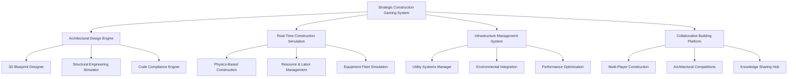

# 🏗️ Enhanced Facility Construction Gaming System v2.0 - Comprehensive Technical Specifications

**Strategic Construction, Infrastructure Management, and Architectural Innovation Gaming Platform**

---

## 📋 **Document Information**

- **Version**: 2.0 (Enhanced Implementation)
- **System Type**: Strategic Construction Gaming with Real-World Education
- **Priority Level**: High (Core Infrastructure System)
- **Dependencies**: Environment, Economy, Progression Systems
- **Integration**: Core Cannabis Cultivation Ecosystem

---

## 🎯 **Executive Summary**

The Enhanced Facility Construction Gaming System v2.0 transforms Project Chimera's construction mechanics into the most sophisticated and engaging building simulation ever created for cannabis cultivation. This system combines strategic city-builder gameplay with authentic construction management, architectural innovation challenges, and collaborative engineering experiences. 

Players evolve from basic tent setups to architectural masterpieces, mastering real-world construction principles while enjoying deeply satisfying building gameplay. The system integrates seamlessly with cultivation, environmental, and economic systems to create a comprehensive facility management experience that's both educational and entertaining.

### **Core Innovation Pillars**

1. **Strategic Construction Gameplay**: Transform building from simple placement to strategic architectural challenges
2. **Real-World Construction Education**: Authentic building codes, structural engineering, and project management
3. **Collaborative Engineering**: Multi-player architectural competitions and team construction projects
4. **Dynamic Infrastructure Management**: Living facilities that adapt, evolve, and present ongoing challenges
5. **Innovation and Creativity**: Tools for architectural creativity and facility optimization breakthroughs

---

## 🏗️ **System Architecture Overview**

### **Multi-Layer Construction Framework**



### **Integration with Core Project Chimera Systems**

- **Cultivation Systems**: Facility design directly impacts growing success and efficiency
- **Environmental Control**: HVAC, lighting, and climate systems integrated with facility architecture
- **Economic Management**: Construction costs, resource procurement, and ROI calculations
- **Progression System**: Construction skills unlock advanced building techniques and materials
- **Research & Development**: New construction technologies and sustainable building innovations

---

## 🎮 **Core Gameplay Mechanics**

### **1. Strategic Architectural Design**

#### **Intelligent Blueprint Creation**
```csharp
public interface IArchitecturalDesigner
{
    // Interactive Design Tools
    Blueprint3D CreateBlueprint(DesignParameters parameters);
    DesignValidation ValidateDesign(Blueprint3D blueprint);
    OptimizationSuggestion OptimizeLayout(Blueprint3D blueprint, OptimizationGoals goals);
    CostEstimate CalculateConstructionCost(Blueprint3D blueprint);
    
    // Architectural Challenges
    ArchitecturalChallenge GenerateDesignChallenge(ChallengeType type, DifficultyLevel difficulty);
    ChallengeSolution EvaluateDesignSolution(ArchitecturalChallenge challenge, Blueprint3D solution);
    
    // Code Compliance and Standards
    ComplianceReport CheckBuildingCodes(Blueprint3D blueprint, RegionalCodes codes);
    SafetyAssessment PerformSafetyAnalysis(Blueprint3D blueprint);
    SustainabilityRating CalculateGreenBuildingScore(Blueprint3D blueprint);
}
```

#### **Multi-Objective Design Optimization**
- **Space Efficiency**: Maximize functional area within plot constraints
- **Energy Performance**: Optimize for HVAC efficiency and lighting effectiveness
- **Workflow Optimization**: Design for optimal cultivation and harvesting operations
- **Structural Integrity**: Balance cost, materials, and engineering requirements
- **Aesthetic Appeal**: Create visually impressive and professional facilities
- **Future Expansion**: Design for scalability and modularity

### **2. Real-Time Construction Simulation**

#### **Physics-Based Building Process**
```csharp
public class ConstructionPhysicsEngine
{
    // Structural Analysis
    private StructuralLoadCalculator _loadCalculator;
    private MaterialStressAnalyzer _stressAnalyzer;
    private FoundationDesigner _foundationDesigner;
    private SeismicResponseAnalyzer _seismicAnalyzer;
    
    // Construction Process Simulation
    private ConstructionSequencer _sequencer;
    private WeatherImpactSimulator _weatherSimulator;
    private QualityControlSimulator _qualityControl;
    private SafetyEventSimulator _safetySimulator;
    
    public ConstructionResult SimulateConstructionStep(ConstructionStep step, EnvironmentalConditions conditions)
    {
        // Validate construction sequence
        var sequenceValidation = ValidateConstructionSequence(step);
        if (!sequenceValidation.IsValid)
            return ConstructionResult.Failed(sequenceValidation.Issues);
        
        // Calculate weather impact
        var weatherImpact = _weatherSimulator.CalculateImpact(step, conditions);
        
        // Simulate construction progress
        var progress = CalculateConstructionProgress(step, weatherImpact);
        
        // Check quality parameters
        var qualityResult = _qualityControl.AssessQuality(step, progress);
        
        // Monitor safety conditions
        var safetyResult = _safetySimulator.CheckSafetyCompliance(step);
        
        return new ConstructionResult
        {
            Progress = progress,
            Quality = qualityResult,
            Safety = safetyResult,
            CostImpact = CalculateCostImpact(progress, qualityResult),
            TimeImpact = CalculateTimeImpact(progress, weatherImpact)
        };
    }
}
```

#### **Intelligent Resource Management**
- **Material Procurement**: Dynamic supply chain with price fluctuations and availability constraints
- **Labor Force Optimization**: Skill-based worker assignment and productivity management
- **Equipment Fleet Management**: Tool and machinery allocation with maintenance scheduling
- **Budget Control**: Real-time cost tracking with variance analysis and forecasting

### **3. Infrastructure Systems Integration**

#### **Comprehensive Utility Design**
```csharp
public class UtilitySystemsIntegrator
{
    // Core Utility Systems
    private ElectricalSystemDesigner _electricalDesigner;
    private PlumbingSystemDesigner _plumbingDesigner;
    private HVACSystemDesigner _hvacDesigner;
    private NetworkInfrastructureDesigner _networkDesigner;
    
    // Integration Engine
    private SystemsIntegrationEngine _integrationEngine;
    private LoadCalculationEngine _loadCalculator;
    private EfficiencyOptimizer _efficiencyOptimizer;
    private MaintenanceScheduler _maintenanceScheduler;
    
    public IntegratedUtilityDesign CreateUtilityDesign(FacilityBlueprint facility, UtilityRequirements requirements)
    {
        var design = new IntegratedUtilityDesign();
        
        // Design individual systems
        design.ElectricalSystem = _electricalDesigner.DesignElectricalSystem(facility, requirements.Electrical);
        design.PlumbingSystem = _plumbingDesigner.DesignPlumbingSystem(facility, requirements.Plumbing);
        design.HVACSystem = _hvacDesigner.DesignHVACSystem(facility, requirements.HVAC);
        design.NetworkSystem = _networkDesigner.DesignNetworkSystem(facility, requirements.Network);
        
        // Optimize system integration
        var integrationResult = _integrationEngine.OptimizeSystemIntegration(design);
        design.IntegrationOptimizations = integrationResult.Optimizations;
        
        // Calculate combined loads and efficiencies
        design.CombinedLoadAnalysis = _loadCalculator.CalculateCombinedLoads(design);
        design.SystemEfficiencies = _efficiencyOptimizer.CalculateSystemEfficiencies(design);
        
        // Plan maintenance requirements
        design.MaintenanceSchedule = _maintenanceScheduler.CreateMaintenanceSchedule(design);
        
        return design;
    }
}
```

#### **Smart Building Technology Integration**
- **IoT Sensor Networks**: Comprehensive monitoring and data collection systems
- **Automated Control Systems**: Intelligent facility management and optimization
- **Energy Management**: Smart grid integration and renewable energy systems
- **Security and Access Control**: Advanced security systems and visitor management
- **Digital Twin Technology**: Real-time digital facility representation and simulation

---

## 🏆 **Challenge and Puzzle Systems**

### **1. Architectural Design Challenges**

#### **Progressive Challenge Framework**
```csharp
public enum ArchitecturalChallengeType
{
    // Spatial Optimization
    SpaceMaximization,          // Maximize growing area within constraints
    EfficiencyOptimization,     // Optimize workflow and operational efficiency
    VerticalFarmingChallenge,   // Multi-level facility design
    ModularExpansionChallenge,  // Design for future growth
    
    // Engineering Challenges
    StructuralInnovation,       // Create novel structural solutions
    SustainabilityChallenge,    // Achieve green building certifications
    DisasterResilience,         // Design for earthquake/hurricane resistance
    AccessibilityCompliance,   // ADA compliance and universal design
    
    // Economic Optimization
    BudgetConstraintChallenge,  // Achieve goals within strict budgets
    ROIMaximization,           // Optimize return on investment
    LongTermValueChallenge,    // Design for 20-year lifecycle value
    CostEfficiencyChallenge,   // Minimize cost per square foot
    
    // Innovation Challenges
    BreakthroughInnovation,    // Pioneer new construction techniques
    TechnologyIntegration,     // Integrate cutting-edge technologies
    SustainabilityPioneer,     // Achieve carbon-neutral construction
    SmartFacilityChallenge     // Create AI-optimized smart facilities
}

public class ArchitecturalChallengeEngine
{
    public ArchitecturalChallenge GenerateChallenge(ArchitecturalChallengeType type, DifficultyLevel difficulty, PlayerSkillProfile playerSkills)
    {
        var challenge = new ArchitecturalChallenge
        {
            Type = type,
            Difficulty = difficulty,
            Title = GenerateChallengeTitle(type, difficulty),
            Description = GenerateChallengeDescription(type, difficulty),
            Constraints = GenerateChallengeConstraints(type, difficulty, playerSkills),
            Objectives = GenerateChallengeObjectives(type, difficulty),
            TimeLimit = CalculateTimeLimit(type, difficulty),
            Rewards = CalculateChallengeRewards(type, difficulty),
            EducationalObjectives = DefineEducationalObjectives(type)
        };
        
        return challenge;
    }
    
    public ChallengeEvaluation EvaluateChallengeSolution(ArchitecturalChallenge challenge, FacilityDesign solution)
    {
        var evaluation = new ChallengeEvaluation();
        
        // Evaluate constraint compliance
        evaluation.ConstraintCompliance = EvaluateConstraintCompliance(solution, challenge.Constraints);
        
        // Score objective achievement
        evaluation.ObjectiveScores = ScoreObjectiveAchievement(solution, challenge.Objectives);
        
        // Assess innovation and creativity
        evaluation.InnovationScore = AssessInnovationLevel(solution, challenge.Type);
        
        // Calculate overall performance
        evaluation.OverallScore = CalculateOverallScore(evaluation);
        
        // Provide improvement feedback
        evaluation.ImprovementSuggestions = GenerateImprovementSuggestions(solution, challenge);
        
        // Award achievements and unlocks
        evaluation.Achievements = AwardAchievements(evaluation, challenge);
        evaluation.Unlocks = DetermineUnlocks(evaluation, challenge);
        
        return evaluation;
    }
}
```

### **2. Construction Management Puzzles**

#### **Strategic Resource Allocation**
- **Supply Chain Optimization**: Minimize costs while ensuring quality and timeline adherence
- **Workforce Coordination**: Optimize team assignments and skill development
- **Equipment Scheduling**: Maximize utilization while minimizing downtime
- **Quality vs. Speed Trade-offs**: Balance construction speed with quality requirements
- **Risk Management**: Navigate weather, supply disruptions, and safety challenges

#### **Real-Time Problem Solving**
- **Emergency Response**: Handle construction site emergencies and adapt plans
- **Design Change Management**: Accommodate client requests while minimizing impact
- **Resource Shortage Resolution**: Creative solutions for material or labor shortages
- **Quality Issue Remediation**: Diagnose and fix construction quality problems
- **Schedule Recovery**: Get projects back on track after delays

### **3. Innovation and Research Challenges**

#### **Technology Development Missions**
```csharp
public class ConstructionInnovationLab
{
    public ResearchProject CreateInnovationProject(InnovationArea area, ResearchDifficulty difficulty)
    {
        return area switch
        {
            InnovationArea.SustainableMaterials => CreateSustainableMaterialsProject(difficulty),
            InnovationArea.AutomatedConstruction => CreateAutomationProject(difficulty),
            InnovationArea.SmartBuildings => CreateSmartBuildingProject(difficulty),
            InnovationArea.ModularConstruction => CreateModularConstructionProject(difficulty),
            InnovationArea.EnergyEfficiency => CreateEnergyEfficiencyProject(difficulty),
            InnovationArea.DisasterResilience => CreateResilienceProject(difficulty),
            _ => throw new ArgumentException($"Unknown innovation area: {area}")
        };
    }
    
    private ResearchProject CreateSustainableMaterialsProject(ResearchDifficulty difficulty)
    {
        return new ResearchProject
        {
            Title = "Next-Generation Sustainable Construction Materials",
            Description = "Develop and test innovative eco-friendly building materials with superior performance characteristics.",
            ResearchGoals = new[]
            {
                "Research bio-based composite materials",
                "Test recycled material applications",
                "Optimize carbon footprint reduction",
                "Validate structural performance",
                "Achieve cost-competitiveness"
            },
            SuccessMetrics = new[]
            {
                "25% reduction in carbon footprint",
                "Equal or better structural performance",
                "Cost within 10% of traditional materials",
                "Successful pilot project implementation"
            },
            Duration = CalculateResearchDuration(difficulty),
            Resources = CalculateResearchResources(difficulty),
            Unlocks = new[] { "Sustainable Material Library", "Green Building Certifications", "Environmental Impact Calculator" }
        };
    }
}
```

---

## 🤝 **Collaborative Building Platform**

### **1. Multi-Player Construction Projects**

#### **Team-Based Construction Management**
```csharp
public class CollaborativeConstructionManager
{
    // Team Management
    private TeamFormationSystem _teamFormation;
    private RoleAssignmentSystem _roleAssignment;
    private CommunicationPlatform _communication;
    private ConflictResolutionSystem _conflictResolution;
    
    // Project Coordination
    private ProjectSynchronizer _projectSync;
    private TaskDistributionEngine _taskDistribution;
    private ProgressCoordinator _progressCoordinator;
    private QualityAssuranceCoordinator _qaCoordinator;
    
    public CollaborativeProject CreateCollaborativeProject(CollaborativeProjectConfig config)
    {
        var project = new CollaborativeProject
        {
            ProjectId = GenerateProjectId(),
            Type = config.ProjectType,
            Complexity = config.Complexity,
            TeamSize = config.MaxTeamSize,
            Duration = config.Duration,
            Objectives = config.Objectives
        };
        
        // Create team structure
        project.Team = _teamFormation.CreateTeam(config.TeamRequirements);
        
        // Assign roles and responsibilities
        _roleAssignment.AssignRoles(project.Team, config.RoleDefinitions);
        
        // Setup communication channels
        project.Communication = _communication.SetupProjectCommunication(project.Team);
        
        // Initialize task distribution
        project.Tasks = _taskDistribution.DistributeProjectTasks(project, config.TaskStructure);
        
        // Setup progress tracking
        project.ProgressTracking = _progressCoordinator.InitializeProgressTracking(project);
        
        return project;
    }
    
    public void ProcessCollaborativeAction(PlayerId playerId, CollaborativeAction action)
    {
        // Validate player permissions
        if (!ValidatePlayerPermissions(playerId, action))
        {
            SendPermissionDeniedMessage(playerId, action);
            return;
        }
        
        // Check for design conflicts
        var conflicts = DetectDesignConflicts(action);
        if (conflicts.Any())
        {
            var resolution = _conflictResolution.ResolveConflicts(conflicts, playerId);
            ApplyConflictResolution(resolution);
        }
        
        // Apply collaborative action
        ApplyCollaborativeAction(action);
        
        // Synchronize with team members
        _projectSync.SynchronizeActionWithTeam(action);
        
        // Update progress tracking
        _progressCoordinator.UpdateProgress(action);
        
        // Trigger team notifications if needed
        ProcessTeamNotifications(action);
    }
}
```

#### **Collaborative Design Tools**
- **Real-Time Co-Design**: Multiple architects working on the same blueprint simultaneously
- **Version Control**: Track design changes and enable rollback to previous versions
- **Comment and Review Systems**: Peer review and feedback mechanisms
- **Skill Complementarity**: Teams combine different expertise areas for optimal results
- **Democratic Decision Making**: Voting systems for major design decisions

### **2. Architectural Competitions**

#### **Competitive Building Events**
```csharp
public class ArchitecturalCompetitionSystem
{
    public Competition CreateCompetition(CompetitionType type, CompetitionParameters parameters)
    {
        return type switch
        {
            CompetitionType.SpeedBuild => CreateSpeedBuildCompetition(parameters),
            CompetitionType.InnovationChallenge => CreateInnovationCompetition(parameters),
            CompetitionType.SustainabilityChallenge => CreateSustainabilityCompetition(parameters),
            CompetitionType.EconomicOptimization => CreateEconomicCompetition(parameters),
            CompetitionType.AestheticDesign => CreateAestheticCompetition(parameters),
            CompetitionType.TeamCollaboration => CreateCollaborationCompetition(parameters),
            _ => throw new ArgumentException($"Unknown competition type: {type}")
        };
    }
    
    private Competition CreateInnovationCompetition(CompetitionParameters parameters)
    {
        return new Competition
        {
            Title = "Cultivation Facility Innovation Challenge",
            Description = "Design the most innovative cannabis cultivation facility incorporating cutting-edge technology and sustainable practices.",
            Duration = TimeSpan.FromDays(7),
            MaxParticipants = 100,
            JudgingCriteria = new[]
            {
                new JudgingCriterion { Name = "Innovation Level", Weight = 0.3f },
                new JudgingCriterion { Name = "Technical Feasibility", Weight = 0.25f },
                new JudgingCriterion { Name = "Sustainability Impact", Weight = 0.25f },
                new JudgingCriterion { Name = "Economic Viability", Weight = 0.2f }
            },
            Prizes = new[]
            {
                new Prize { Rank = 1, Reward = "Legendary Blueprint Collection + 50,000 Research Points" },
                new Prize { Rank = 2, Reward = "Advanced Building Materials + 30,000 Research Points" },
                new Prize { Rank = 3, Reward = "Smart Building Technology + 20,000 Research Points" }
            },
            SpecialRequirements = new[]
            {
                "Must incorporate at least 3 innovative technologies",
                "Achieve minimum sustainability rating of 85%",
                "Include detailed feasibility analysis",
                "Present design rationale and innovation justification"
            }
        };
    }
}
```

#### **Judging and Recognition Systems**
- **Multi-Criteria Evaluation**: Technical excellence, innovation, sustainability, aesthetics
- **Peer Review Process**: Community voting and expert panel evaluation
- **Achievement Recognition**: Badges, titles, and unlockable content for outstanding designs
- **Design Showcase**: Gallery of winning designs for community inspiration
- **Educational Integration**: Competitions tied to learning objectives and skill development

### **3. Knowledge Sharing and Mentorship**

#### **Community Learning Platform**
- **Tutorial Creation**: Players create and share construction tutorials
- **Best Practices Library**: Curated collection of proven design patterns and techniques
- **Mentorship Programs**: Experienced builders guide newcomers through complex projects
- **Q&A Forums**: Expert advice and problem-solving assistance
- **Live Workshops**: Interactive sessions on advanced construction topics

---

## 📈 **Performance and Optimization Systems**

### **1. Real-Time Performance Analytics**

#### **Comprehensive Facility Performance Monitoring**
```csharp
public class FacilityPerformanceAnalyzer
{
    // Performance Metrics Tracking
    private EnergyEfficiencyAnalyzer _energyAnalyzer;
    private SpaceUtilizationAnalyzer _spaceAnalyzer;
    private WorkflowEfficiencyAnalyzer _workflowAnalyzer;
    private MaintenanceCostAnalyzer _maintenanceAnalyzer;
    private ProductivityAnalyzer _productivityAnalyzer;
    
    // Optimization Engines
    private LayoutOptimizer _layoutOptimizer;
    private SystemsOptimizer _systemsOptimizer;
    private CostOptimizer _costOptimizer;
    private EfficiencyOptimizer _efficiencyOptimizer;
    
    public FacilityPerformanceReport GeneratePerformanceReport(Facility facility, TimeRange period)
    {
        var report = new FacilityPerformanceReport
        {
            Facility = facility,
            AnalysisPeriod = period,
            GenerationTime = DateTime.Now
        };
        
        // Energy Performance Analysis
        report.EnergyPerformance = _energyAnalyzer.AnalyzeEnergyUsage(facility, period);
        
        // Space Utilization Analysis
        report.SpaceUtilization = _spaceAnalyzer.AnalyzeSpaceUsage(facility, period);
        
        // Workflow Efficiency Analysis
        report.WorkflowEfficiency = _workflowAnalyzer.AnalyzeWorkflowPatterns(facility, period);
        
        // Maintenance Cost Analysis
        report.MaintenanceCosts = _maintenanceAnalyzer.AnalyzeMaintenanceCosts(facility, period);
        
        // Overall Productivity Analysis
        report.ProductivityMetrics = _productivityAnalyzer.AnalyzeProductivity(facility, period);
        
        // Generate optimization recommendations
        report.OptimizationRecommendations = GenerateOptimizationRecommendations(report);
        
        return report;
    }
    
    public OptimizationRecommendations GenerateOptimizationRecommendations(FacilityPerformanceReport report)
    {
        var recommendations = new OptimizationRecommendations();
        
        // Layout optimization suggestions
        if (report.SpaceUtilization.EfficiencyScore < 0.8f)
        {
            recommendations.LayoutOptimizations = _layoutOptimizer.SuggestLayoutImprovements(report);
        }
        
        // Systems optimization suggestions
        if (report.EnergyPerformance.EfficiencyScore < 0.75f)
        {
            recommendations.SystemOptimizations = _systemsOptimizer.SuggestSystemImprovements(report);
        }
        
        // Cost optimization suggestions
        if (report.MaintenanceCosts.CostPerSquareFoot > industry_benchmark)
        {
            recommendations.CostOptimizations = _costOptimizer.SuggestCostReductions(report);
        }
        
        // Workflow optimization suggestions
        if (report.WorkflowEfficiency.EfficiencyScore < 0.85f)
        {
            recommendations.WorkflowOptimizations = _efficiencyOptimizer.SuggestWorkflowImprovements(report);
        }
        
        return recommendations;
    }
}
```

### **2. AI-Powered Design Assistant**

#### **Intelligent Design Optimization Engine**
```csharp
public class AIDesignAssistant
{
    // AI Analysis Engines
    private MachineLearningDesignAnalyzer _mlAnalyzer;
    private PatternRecognitionEngine _patternRecognition;
    private OptimizationRecommendationEngine _recommendationEngine;
    private PredictivePerformanceModeler _performanceModeler;
    
    // Knowledge Base
    private DesignPatternDatabase _designPatterns;
    private BestPracticesLibrary _bestPractices;
    private HistoricalPerformanceDatabase _performanceHistory;
    private RegulatoryKnowledgeBase _regulatoryKnowledge;
    
    public AIDesignRecommendations AnalyzeDesignAndRecommend(FacilityDesign design, DesignObjectives objectives)
    {
        var recommendations = new AIDesignRecommendations();
        
        // Analyze current design patterns
        var patternAnalysis = _patternRecognition.AnalyzeDesignPatterns(design);
        
        // Identify optimization opportunities
        var optimizations = _mlAnalyzer.IdentifyOptimizationOpportunities(design, objectives);
        
        // Predict performance outcomes
        var performancePrediction = _performanceModeler.PredictFacilityPerformance(design);
        
        // Generate specific recommendations
        recommendations.LayoutRecommendations = GenerateLayoutRecommendations(design, patternAnalysis);
        recommendations.SystemRecommendations = GenerateSystemRecommendations(design, optimizations);
        recommendations.MaterialRecommendations = GenerateMaterialRecommendations(design, objectives);
        recommendations.ComplianceRecommendations = GenerateComplianceRecommendations(design);
        
        // Provide confidence scores and reasoning
        recommendations.ConfidenceScores = CalculateRecommendationConfidence(recommendations);
        recommendations.ReasoningExplanations = GenerateReasoningExplanations(recommendations);
        
        return recommendations;
    }
    
    public DesignComparison CompareDesignAlternatives(List<FacilityDesign> alternatives, ComparisonCriteria criteria)
    {
        var comparison = new DesignComparison();
        
        foreach (var design in alternatives)
        {
            var analysis = new DesignAnalysis
            {
                Design = design,
                PerformancePrediction = _performanceModeler.PredictFacilityPerformance(design),
                ComplianceAssessment = AssessRegulatoryCompliance(design),
                CostEstimate = EstimateConstructionAndOperationalCosts(design),
                SustainabilityRating = CalculateSustainabilityRating(design),
                InnovationScore = AssessInnovationLevel(design)
            };
            
            comparison.DesignAnalyses.Add(analysis);
        }
        
        // Rank designs based on criteria
        comparison.Rankings = RankDesigns(comparison.DesignAnalyses, criteria);
        
        // Generate comparative insights
        comparison.ComparativeInsights = GenerateComparativeInsights(comparison.DesignAnalyses);
        
        return comparison;
    }
}
```

### **3. Sustainable Building Innovation**

#### **Green Building Certification System**
```csharp
public class SustainableBuildingSystem
{
    public GreenBuildingAssessment AssessSustainability(FacilityDesign design)
    {
        var assessment = new GreenBuildingAssessment();
        
        // Energy Efficiency Assessment
        assessment.EnergyEfficiency = AssessEnergyEfficiency(design);
        
        // Water Conservation Assessment
        assessment.WaterConservation = AssessWaterConservation(design);
        
        // Material Sustainability Assessment
        assessment.MaterialSustainability = AssessMaterialSustainability(design);
        
        // Indoor Environmental Quality Assessment
        assessment.IndoorEnvironmentalQuality = AssessIndoorEnvironmentalQuality(design);
        
        // Innovation and Design Process Assessment
        assessment.InnovationAndDesign = AssessInnovationAndDesign(design);
        
        // Calculate overall sustainability rating
        assessment.OverallRating = CalculateOverallSustainabilityRating(assessment);
        
        // Determine certification levels
        assessment.CertificationLevel = DetermineCertificationLevel(assessment.OverallRating);
        
        // Generate improvement recommendations
        assessment.ImprovementRecommendations = GenerateSustainabilityImprovements(assessment);
        
        return assessment;
    }
    
    private EnergyEfficiencyAssessment AssessEnergyEfficiency(FacilityDesign design)
    {
        return new EnergyEfficiencyAssessment
        {
            // Building Envelope Performance
            InsulationEfficiency = AssessInsulationEfficiency(design.BuildingEnvelope),
            WindowPerformance = AssessWindowPerformance(design.Windows),
            AirTightnessRating = AssessAirTightness(design.BuildingEnvelope),
            
            // HVAC System Efficiency
            HVACEfficiency = AssessHVACEfficiency(design.HVACSystem),
            VentilationEffectiveness = AssessVentilationEffectiveness(design.VentilationSystem),
            
            // Lighting Efficiency
            LightingEfficiency = AssessLightingEfficiency(design.LightingSystem),
            NaturalLightUtilization = AssessNaturalLighting(design.Windows, design.Layout),
            
            // Renewable Energy Integration
            RenewableEnergyPercentage = CalculateRenewableEnergyPercentage(design.EnergySystem),
            EnergyStorageCapacity = AssessEnergyStorageCapacity(design.EnergySystem),
            
            // Smart Building Technology
            SmartControlsIntegration = AssessSmartControlsIntegration(design.AutomationSystems),
            EnergyMonitoringCapabilities = AssessEnergyMonitoring(design.MonitoringSystems)
        };
    }
}
```

---

## 🎓 **Educational Integration Framework**

### **1. Real-World Construction Education**

#### **Comprehensive Learning Modules**
```csharp
public class ConstructionEducationSystem
{
    // Educational Content Management
    private CurriculumManager _curriculumManager;
    private LearningPathOptimizer _learningPathOptimizer;
    private AssessmentEngine _assessmentEngine;
    private ProgressTracker _progressTracker;
    
    // Interactive Learning Tools
    private VirtualConstructionSite _virtualSite;
    private AR_ConstructionTrainer _arTrainer;
    private SimulationBasedLearning _simulationLearning;
    private CaseStudyLibrary _caseStudyLibrary;
    
    public LearningPath CreatePersonalizedLearningPath(PlayerProfile player, LearningObjectives objectives)
    {
        var learningPath = new LearningPath
        {
            Player = player,
            Objectives = objectives,
            EstimatedDuration = CalculateEstimatedDuration(objectives, player.CurrentSkillLevel)
        };
        
        // Assess current knowledge level
        var knowledgeAssessment = _assessmentEngine.AssessCurrentKnowledge(player);
        
        // Identify knowledge gaps
        var knowledgeGaps = IdentifyKnowledgeGaps(knowledgeAssessment, objectives);
        
        // Generate customized learning modules
        learningPath.Modules = GenerateLearningModules(knowledgeGaps, player.LearningPreferences);
        
        // Optimize learning sequence
        learningPath.OptimizedSequence = _learningPathOptimizer.OptimizeModuleSequence(learningPath.Modules);
        
        // Set up progress milestones
        learningPath.Milestones = CreateProgressMilestones(learningPath.OptimizedSequence);
        
        return learningPath;
    }
    
    public EducationModule CreateConstructionModule(ConstructionTopic topic, SkillLevel targetLevel)
    {
        return topic switch
        {
            ConstructionTopic.StructuralEngineering => CreateStructuralEngineeringModule(targetLevel),
            ConstructionTopic.ProjectManagement => CreateProjectManagementModule(targetLevel),
            ConstructionTopic.BuildingCodes => CreateBuildingCodesModule(targetLevel),
            ConstructionTopic.SustainableConstruction => CreateSustainableConstructionModule(targetLevel),
            ConstructionTopic.SafetyManagement => CreateSafetyManagementModule(targetLevel),
            ConstructionTopic.CostEstimation => CreateCostEstimationModule(targetLevel),
            _ => throw new ArgumentException($"Unknown construction topic: {topic}")
        };
    }
}
```

#### **Construction Education Topics**

**Structural Engineering Fundamentals**
- Load calculations and structural analysis
- Material properties and selection
- Foundation design principles
- Seismic and wind resistance design
- Structural code compliance

**Project Management Excellence**
- Project planning and scheduling
- Resource allocation and optimization
- Risk management and mitigation
- Quality control and assurance
- Stakeholder communication

**Building Codes and Regulations**
- International Building Code (IBC) principles
- Local code variations and requirements
- Permit processes and inspections
- ADA compliance and accessibility
- Fire safety and life safety codes

**Sustainable Construction Practices**
- Green building certification systems
- Energy-efficient design strategies
- Sustainable material selection
- Water conservation techniques
- Renewable energy integration

### **2. Professional Skill Development**

#### **Industry-Relevant Certifications**
```csharp
public class ProfessionalCertificationSystem
{
    public CertificationProgram CreateCertificationProgram(CertificationType type, IndustryStandard standard)
    {
        return type switch
        {
            CertificationType.ProjectManager => CreateProjectManagementCertification(standard),
            CertificationType.StructuralEngineer => CreateStructuralEngineeringCertification(standard),
            CertificationType.SustainabilitySpecialist => CreateSustainabilityCertification(standard),
            CertificationType.SafetyManager => CreateSafetyManagementCertification(standard),
            CertificationType.CostEstimator => CreateCostEstimationCertification(standard),
            _ => throw new ArgumentException($"Unknown certification type: {type}")
        };
    }
    
    private CertificationProgram CreateProjectManagementCertification(IndustryStandard standard)
    {
        return new CertificationProgram
        {
            Title = "Certified Construction Project Manager",
            Description = "Comprehensive project management certification for construction industry professionals",
            Requirements = new CertificationRequirements
            {
                Prerequisites = new[]
                {
                    "Complete Basic Construction Management course",
                    "Successfully manage 3 virtual construction projects",
                    "Achieve 85% average on module assessments"
                },
                Competencies = new[]
                {
                    "Project Planning and Scheduling",
                    "Resource Management and Allocation",
                    "Risk Assessment and Mitigation",
                    "Quality Control and Assurance",
                    "Stakeholder Communication",
                    "Budget Management and Cost Control",
                    "Team Leadership and Coordination",
                    "Contract Administration"
                },
                FinalAssessment = new FinalAssessment
                {
                    Type = AssessmentType.ComprehensiveProject,
                    Description = "Plan and execute a complex multi-phase construction project",
                    Duration = TimeSpan.FromHours(8),
                    PassingScore = 85,
                    RetakePolicy = "Up to 2 retakes with additional study requirements"
                }
            },
            Benefits = new[]
            {
                "Industry-recognized credential",
                "Advanced project management tools unlock",
                "Exclusive access to professional development resources",
                "Networking opportunities with industry professionals",
                "Potential real-world job placement assistance"
            },
            ContinuingEducation = new ContinuingEducationRequirements
            {
                HoursPerYear = 40,
                AcceptedActivities = new[]
                {
                    "Advanced construction management courses",
                    "Industry conference attendance",
                    "Professional development workshops",
                    "Mentoring other certification candidates"
                }
            }
        };
    }
}
```

#### **Career Development Pathways**
- **Entry Level**: Basic construction understanding and safety awareness
- **Skilled Tradesperson**: Specialized knowledge in specific construction disciplines
- **Supervisor/Foreman**: Team leadership and project coordination skills
- **Project Manager**: Comprehensive project management and strategic planning
- **Executive/Owner**: Business development and organizational leadership

### **3. Real-World Application Bridge**

#### **Industry Partnership Program**
```csharp
public class IndustryPartnershipSystem
{
    public IndustryPartnership EstablishPartnership(ConstructionCompany company, PartnershipType type)
    {
        var partnership = new IndustryPartnership
        {
            Company = company,
            Type = type,
            StartDate = DateTime.Now,
            Status = PartnershipStatus.Active
        };
        
        switch (type)
        {
            case PartnershipType.EducationalCollaboration:
                partnership.Activities = SetupEducationalCollaboration(company);
                break;
                
            case PartnershipType.InternshipProgram:
                partnership.Activities = SetupInternshipProgram(company);
                break;
                
            case PartnershipType.ProjectConsultation:
                partnership.Activities = SetupProjectConsultation(company);
                break;
                
            case PartnershipType.TechnologyTransfer:
                partnership.Activities = SetupTechnologyTransfer(company);
                break;
        }
        
        return partnership;
    }
    
    private List<PartnershipActivity> SetupEducationalCollaboration(ConstructionCompany company)
    {
        return new List<PartnershipActivity>
        {
            new GuestLectureProgram
            {
                Frequency = "Monthly",
                Topics = company.ExpertiseAreas,
                ExpertPool = company.SeniorProfessionals
            },
            new RealProjectCaseStudies
            {
                ProjectTypes = company.ProjectTypes,
                UpdateFrequency = "Quarterly",
                DetailLevel = "Educational"
            },
            new IndustryInsightsSharing
            {
                MarketTrends = true,
                TechnologyUpdates = true,
                RegulatoryChanges = true
            },
            new StudentMentorshipProgram
            {
                MentorCount = company.AvailableMentors,
                MenteeCapacity = CalculateMenteeCapacity(company),
                SessionFrequency = "Bi-weekly"
            }
        };
    }
}
```

---

## 🔧 **Technical Implementation Architecture**

### **1. Core Construction Gaming Engine**

#### **Enhanced Construction Manager**
```csharp
public class EnhancedConstructionGamingManager : ChimeraManager, IConstructionGamingSystem
{
    [Header("Construction Gaming Configuration")]
    [SerializeField] private ConstructionGamingConfigSO _constructionConfig;
    [SerializeField] private bool _enableRealTimeConstruction = true;
    [SerializeField] private bool _enableCollaborativeBuilding = true;
    [SerializeField] private bool _enableEducationalMode = true;
    [SerializeField] private bool _enableCompetitiveMode = true;
    [SerializeField] private bool _enableAIAssistant = true;
    
    [Header("System Integration")]
    [SerializeField] private GameEventChannelSO _constructionEventChannel;
    [SerializeField] private GameEventChannelSO _environmentalEventChannel;
    [SerializeField] private GameEventChannelSO _economicEventChannel;
    [SerializeField] private GameEventChannelSO _progressionEventChannel;
    
    [Header("Performance Settings")]
    [SerializeField] private float _systemUpdateInterval = 0.05f;
    [SerializeField] private int _maxConcurrentProjects = 25;
    [SerializeField] private bool _enableAdvancedPhysics = true;
    [SerializeField] private bool _enablePerformanceOptimization = true;
    
    // Core Construction Systems
    private ArchitecturalDesignEngine _designEngine;
    private ConstructionSimulationEngine _simulationEngine;
    private StructuralEngineeringSystem _structuralSystem;
    private UtilitySystemsManager _utilityManager;
    private SmartBuildingTechnology _smartTechnology;
    
    // Gaming Systems
    private ConstructionChallengeEngine _challengeEngine;
    private CollaborativeConstructionSystem _collaborationSystem;
    private ArchitecturalCompetitionManager _competitionManager;
    private ConstructionEducationSystem _educationSystem;
    private AchievementTrackingSystem _achievementSystem;
    
    // Resource and Project Management
    private ConstructionResourceManager _resourceManager;
    private ProjectManagementSystem _projectManager;
    private SupplyChainSimulator _supplyChainSimulator;
    private LaborForceManagement _laborManagement;
    private EquipmentFleetManager _equipmentManager;
    
    // AI and Analytics
    private AIDesignAssistant _aiAssistant;
    private PerformanceAnalyticsEngine _analyticsEngine;
    private OptimizationRecommendationEngine _optimizationEngine;
    private PredictiveMaintenanceSystem _predictiveMaintenanceSystem;
    
    // State Management
    private Dictionary<string, ConstructionProject> _activeProjects = new Dictionary<string, ConstructionProject>();
    private Dictionary<string, CollaborativeSession> _collaborativeSessions = new Dictionary<string, CollaborativeSession>();
    private Dictionary<string, ArchitecturalCompetition> _activeCompetitions = new Dictionary<string, ArchitecturalCompetition>();
    private Dictionary<string, EducationSession> _educationSessions = new Dictionary<string, EducationSession>();
    
    // Performance Optimization
    private ConstructionUpdateScheduler _updateScheduler;
    private PerformanceProfiler _performanceProfiler;
    private float _lastSystemUpdate;
    
    // Events
    public event Action<ConstructionProject> OnProjectStarted;
    public event Action<ConstructionProject> OnProjectCompleted;
    public event Action<ConstructionMilestone> OnMilestoneAchieved;
    public event Action<StructuralAlert> OnStructuralAlert;
    public event Action<CollaborativeSession> OnCollaborationStarted;
    public event Action<ArchitecturalCompetition> OnCompetitionStarted;
    public event Action<EducationAchievement> OnEducationAchievement;
    
    #region Initialization
    
    protected override void InitializeManager()
    {
        base.InitializeManager();
        
        InitializeConstructionSystems();
        InitializeGamingSystems();
        InitializeResourceManagement();
        InitializeAIAndAnalytics();
        InitializePerformanceOptimization();
        
        if (_enableDebugLogging)
        {
            Debug.Log("[EnhancedConstructionGamingManager] All construction gaming systems initialized successfully");
        }
    }
    
    private void InitializeConstructionSystems()
    {
        // Initialize core construction engines
        _designEngine = new ArchitecturalDesignEngine();
        _designEngine.Initialize(_constructionConfig.DesignConfiguration);
        
        _simulationEngine = new ConstructionSimulationEngine();
        _simulationEngine.Initialize(_constructionConfig.SimulationConfiguration);
        
        _structuralSystem = new StructuralEngineeringSystem();
        _structuralSystem.Initialize(_constructionConfig.StructuralConfiguration);
        
        _utilityManager = new UtilitySystemsManager();
        _utilityManager.Initialize(_constructionConfig.UtilityConfiguration);
        
        _smartTechnology = new SmartBuildingTechnology();
        _smartTechnology.Initialize(_constructionConfig.SmartTechnologyConfiguration);
    }
    
    private void InitializeGamingSystems()
    {
        // Initialize gaming and challenge systems
        _challengeEngine = new ConstructionChallengeEngine();
        _challengeEngine.Initialize(_constructionConfig.ChallengeConfiguration);
        
        _collaborationSystem = new CollaborativeConstructionSystem();
        _collaborationSystem.Initialize(_constructionConfig.CollaborationConfiguration);
        
        _competitionManager = new ArchitecturalCompetitionManager();
        _competitionManager.Initialize(_constructionConfig.CompetitionConfiguration);
        
        _educationSystem = new ConstructionEducationSystem();
        _educationSystem.Initialize(_constructionConfig.EducationConfiguration);
        
        _achievementSystem = new AchievementTrackingSystem();
        _achievementSystem.Initialize(_constructionConfig.AchievementConfiguration);
    }
    
    private void InitializeResourceManagement()
    {
        // Initialize resource and project management systems
        _resourceManager = new ConstructionResourceManager();
        _resourceManager.Initialize(_constructionConfig.ResourceConfiguration);
        
        _projectManager = new ProjectManagementSystem();
        _projectManager.Initialize(_constructionConfig.ProjectConfiguration);
        
        _supplyChainSimulator = new SupplyChainSimulator();
        _supplyChainSimulator.Initialize(_constructionConfig.SupplyChainConfiguration);
        
        _laborManagement = new LaborForceManagement();
        _laborManagement.Initialize(_constructionConfig.LaborConfiguration);
        
        _equipmentManager = new EquipmentFleetManager();
        _equipmentManager.Initialize(_constructionConfig.EquipmentConfiguration);
    }
    
    private void InitializeAIAndAnalytics()
    {
        // Initialize AI and analytics systems
        _aiAssistant = new AIDesignAssistant();
        _aiAssistant.Initialize(_constructionConfig.AIConfiguration);
        
        _analyticsEngine = new PerformanceAnalyticsEngine();
        _analyticsEngine.Initialize(_constructionConfig.AnalyticsConfiguration);
        
        _optimizationEngine = new OptimizationRecommendationEngine();
        _optimizationEngine.Initialize(_constructionConfig.OptimizationConfiguration);
        
        _predictiveMaintenanceSystem = new PredictiveMaintenanceSystem();
        _predictiveMaintenanceSystem.Initialize(_constructionConfig.MaintenanceConfiguration);
    }
    
    private void InitializePerformanceOptimization()
    {
        _updateScheduler = new ConstructionUpdateScheduler();
        _updateScheduler.Initialize(_systemUpdateInterval, _maxConcurrentProjects);
        
        _performanceProfiler = new PerformanceProfiler();
        _performanceProfiler.Initialize("ConstructionGaming", _enablePerformanceOptimization);
    }
    
    #endregion
    
    #region Core Construction Management
    
    public ConstructionProject CreateConstructionProject(ConstructionProjectRequest request)
    {
        try
        {
            // Validate project request
            var validation = ValidateProjectRequest(request);
            if (!validation.IsValid)
            {
                throw new InvalidOperationException($"Invalid project request: {validation.ErrorMessage}");
            }
            
            // Create project instance
            var project = new ConstructionProject
            {
                ProjectId = GenerateProjectId(),
                Type = request.ProjectType,
                Complexity = request.Complexity,
                Blueprint = request.Blueprint,
                Budget = request.Budget,
                Timeline = request.Timeline,
                Requirements = request.Requirements,
                CreatedBy = request.CreatedBy,
                CreationTime = DateTime.Now,
                Status = ProjectStatus.Planning
            };
            
            // Initialize project systems
            InitializeProjectSystems(project);
            
            // Add to active projects
            _activeProjects[project.ProjectId] = project;
            
            // Start project management
            _projectManager.StartProject(project);
            
            // Trigger project started event
            OnProjectStarted?.Invoke(project);
            
            // Raise global event
            _constructionEventChannel.RaiseEvent(new ConstructionProjectStartedEventData
            {
                ProjectId = project.ProjectId,
                ProjectType = project.Type,
                EstimatedDuration = project.Timeline.EstimatedDuration,
                Budget = project.Budget.TotalBudget
            });
            
            return project;
        }
        catch (Exception ex)
        {
            Debug.LogError($"[EnhancedConstructionGamingManager] Error creating construction project: {ex.Message}");
            throw;
        }
    }
    
    public void UpdateConstructionProject(string projectId, float deltaTime)
    {
        if (!_activeProjects.TryGetValue(projectId, out var project))
            return;
        
        try
        {
            // Update construction simulation
            _simulationEngine.UpdateConstruction(project, deltaTime);
            
            // Update resource management
            _resourceManager.UpdateProjectResources(project, deltaTime);
            
            // Update labor force
            _laborManagement.UpdateLaborForce(project, deltaTime);
            
            // Update equipment usage
            _equipmentManager.UpdateEquipmentUsage(project, deltaTime);
            
            // Update project management
            _projectManager.UpdateProject(project, deltaTime);
            
            // Check for milestone achievements
            CheckMilestoneAchievements(project);
            
            // Check for completion
            if (project.Progress >= 100f)
            {
                CompleteConstructionProject(project);
            }
        }
        catch (Exception ex)
        {
            Debug.LogError($"[EnhancedConstructionGamingManager] Error updating construction project {projectId}: {ex.Message}");
        }
    }
    
    private void CompleteConstructionProject(ConstructionProject project)
    {
        try
        {
            // Finalize project
            project.Status = ProjectStatus.Completed;
            project.CompletionTime = DateTime.Now;
            project.ActualDuration = project.CompletionTime - project.CreationTime;
            
            // Generate project report
            var projectReport = GenerateProjectCompletionReport(project);
            project.CompletionReport = projectReport;
            
            // Update player progression
            UpdatePlayerProgression(project);
            
            // Award achievements
            AwardProjectAchievements(project);
            
            // Update analytics
            _analyticsEngine.RecordProjectCompletion(project);
            
            // Trigger completion event
            OnProjectCompleted?.Invoke(project);
            
            // Raise global event
            _constructionEventChannel.RaiseEvent(new ConstructionProjectCompletedEventData
            {
                ProjectId = project.ProjectId,
                FinalCost = project.Budget.TotalSpent,
                ActualDuration = project.ActualDuration,
                QualityScore = projectReport.QualityScore,
                EfficiencyScore = projectReport.EfficiencyScore
            });
            
            if (_enableDebugLogging)
            {
                Debug.Log($"[EnhancedConstructionGamingManager] Construction project {project.ProjectId} completed successfully");
            }
        }
        catch (Exception ex)
        {
            Debug.LogError($"[EnhancedConstructionGamingManager] Error completing construction project: {ex.Message}");
        }
    }
    
    #endregion
    
    #region Challenge System Integration
    
    public ConstructionChallenge CreateConstructionChallenge(ConstructionChallengeType challengeType, DifficultyLevel difficulty)
    {
        try
        {
            var challenge = _challengeEngine.CreateChallenge(challengeType, difficulty);
            
            // Add educational objectives
            if (_enableEducationalMode)
            {
                challenge.EducationalObjectives = _educationSystem.GetEducationalObjectives(challengeType);
            }
            
            // Set up achievement tracking
            _achievementSystem.TrackChallengeStart(challenge);
            
            return challenge;
        }
        catch (Exception ex)
        {
            Debug.LogError($"[EnhancedConstructionGamingManager] Error creating construction challenge: {ex.Message}");
            throw;
        }
    }
    
    public ChallengeResult SubmitChallengeResponse(string challengeId, ConstructionSolution solution)
    {
        try
        {
            var result = _challengeEngine.EvaluateChallengeSolution(challengeId, solution);
            
            // Update educational progress
            if (_enableEducationalMode)
            {
                _educationSystem.UpdateEducationalProgress(solution.PlayerId, result);
            }
            
            // Award achievements
            _achievementSystem.ProcessChallengeCompletion(challengeId, result);
            
            // Update analytics
            _analyticsEngine.RecordChallengeCompletion(challengeId, result);
            
            return result;
        }
        catch (Exception ex)
        {
            Debug.LogError($"[EnhancedConstructionGamingManager] Error submitting challenge response: {ex.Message}");
            throw;
        }
    }
    
    #endregion
    
    #region Collaborative Construction
    
    public CollaborativeSession StartCollaborativeProject(CollaborativeProjectConfig config)
    {
        try
        {
            var session = _collaborationSystem.CreateCollaborativeSession(config);
            
            // Add to active sessions
            _collaborativeSessions[session.SessionId] = session;
            
            // Set up project management for collaboration
            _projectManager.InitializeCollaborativeProject(session);
            
            // Trigger collaboration started event
            OnCollaborationStarted?.Invoke(session);
            
            return session;
        }
        catch (Exception ex)
        {
            Debug.LogError($"[EnhancedConstructionGamingManager] Error starting collaborative project: {ex.Message}");
            throw;
        }
    }
    
    public void ProcessCollaborativeAction(string sessionId, PlayerId playerId, CollaborativeAction action)
    {
        if (!_collaborativeSessions.TryGetValue(sessionId, out var session))
            return;
        
        try
        {
            _collaborationSystem.ProcessCollaborativeAction(session, playerId, action);
            
            // Update project progress
            if (action.AffectsProject)
            {
                var project = _activeProjects[session.ProjectId];
                UpdateConstructionProject(project.ProjectId, 0f); // Force update
            }
        }
        catch (Exception ex)
        {
            Debug.LogError($"[EnhancedConstructionGamingManager] Error processing collaborative action: {ex.Message}");
        }
    }
    
    #endregion
    
    #region Update Cycles
    
    protected override void UpdateManager()
    {
        base.UpdateManager();
        
        var currentTime = Time.time;
        if (currentTime - _lastSystemUpdate < _systemUpdateInterval)
            return;
        
        _performanceProfiler.BeginSample("ConstructionSystemUpdate");
        
        try
        {
            // Update all active construction projects
            var projectsToUpdate = _updateScheduler.GetProjectsToUpdate(_activeProjects.Values);
            
            foreach (var project in projectsToUpdate)
            {
                UpdateConstructionProject(project.ProjectId, _systemUpdateInterval);
            }
            
            // Update collaborative sessions
            foreach (var session in _collaborativeSessions.Values)
            {
                _collaborationSystem.UpdateCollaborativeSession(session, _systemUpdateInterval);
            }
            
            // Update competitions
            foreach (var competition in _activeCompetitions.Values)
            {
                _competitionManager.UpdateCompetition(competition, _systemUpdateInterval);
            }
            
            // Update AI and analytics
            if (_enableAIAssistant)
            {
                _aiAssistant.Update(_systemUpdateInterval);
            }
            
            _analyticsEngine.Update(_systemUpdateInterval);
            
            _lastSystemUpdate = currentTime;
        }
        catch (Exception ex)
        {
            Debug.LogError($"[EnhancedConstructionGamingManager] Error in system update: {ex.Message}");
        }
        finally
        {
            _performanceProfiler.EndSample();
        }
    }
    
    #endregion
    
    #region Helper Methods
    
    private string GenerateProjectId()
    {
        return $"PROJ_{DateTime.Now:yyyyMMddHHmmss}_{Random.Range(1000, 9999)}";
    }
    
    private ProjectValidationResult ValidateProjectRequest(ConstructionProjectRequest request)
    {
        var result = new ProjectValidationResult { IsValid = true };
        
        if (request.Budget.TotalBudget <= 0)
        {
            result.IsValid = false;
            result.ErrorMessage = "Project budget must be greater than zero";
            return result;
        }
        
        if (request.Timeline.EstimatedDuration <= TimeSpan.Zero)
        {
            result.IsValid = false;
            result.ErrorMessage = "Project timeline must be greater than zero";
            return result;
        }
        
        if (_activeProjects.Count >= _maxConcurrentProjects)
        {
            result.IsValid = false;
            result.ErrorMessage = "Maximum concurrent projects limit reached";
            return result;
        }
        
        return result;
    }
    
    private void CheckMilestoneAchievements(ConstructionProject project)
    {
        var achievedMilestones = project.Milestones.Where(m => !m.IsAchieved && project.Progress >= m.RequiredProgress).ToList();
        
        foreach (var milestone in achievedMilestones)
        {
            milestone.IsAchieved = true;
            milestone.AchievedTime = DateTime.Now;
            
            OnMilestoneAchieved?.Invoke(milestone);
            
            // Update progression system
            _progressionEventChannel.RaiseEvent(new ConstructionMilestoneAchievedEventData
            {
                ProjectId = project.ProjectId,
                MilestoneId = milestone.MilestoneId,
                ExperienceGained = milestone.ExperienceReward,
                SkillPointsGained = milestone.SkillPointReward
            });
        }
    }
    
    #endregion
    
    #region IConstructionGamingSystem Implementation
    
    public List<ConstructionProject> GetActiveProjects()
    {
        return _activeProjects.Values.ToList();
    }
    
    public ConstructionProject GetProject(string projectId)
    {
        return _activeProjects.TryGetValue(projectId, out var project) ? project : null;
    }
    
    public List<ConstructionChallenge> GetAvailableChallenges(DifficultyLevel? difficulty = null)
    {
        return _challengeEngine.GetAvailableChallenges(difficulty);
    }
    
    public List<CollaborativeSession> GetActiveCollaborativeSessions()
    {
        return _collaborativeSessions.Values.ToList();
    }
    
    public ConstructionAnalytics GetConstructionAnalytics()
    {
        return _analyticsEngine.GetConstructionAnalytics();
    }
    
    #endregion
}
```

### **2. Data Structures and Supporting Systems**

#### **Core Construction Data Models**
```csharp
[System.Serializable]
public class ConstructionProject
{
    public string ProjectId;
    public string ProjectName;
    public ProjectType Type;
    public ComplexityLevel Complexity;
    public ProjectStatus Status;
    
    // Design and Planning
    public FacilityBlueprint Blueprint;
    public ConstructionPlan ConstructionPlan;
    public ResourceRequirements ResourceRequirements;
    public ProjectTimeline Timeline;
    public ProjectBudget Budget;
    
    // Progress Tracking
    public float Progress; // 0-100
    public List<ConstructionMilestone> Milestones;
    public List<ConstructionPhase> Phases;
    public ConstructionMetrics Metrics;
    
    // Team and Resources
    public ProjectTeam Team;
    public List<AssignedWorker> AssignedWorkers;
    public List<AssignedEquipment> AssignedEquipment;
    public List<MaterialDelivery> MaterialDeliveries;
    
    // Quality and Compliance
    public QualityAssessment QualityAssessment;
    public ComplianceStatus ComplianceStatus;
    public List<SafetyIncident> SafetyIncidents;
    public List<Inspection> Inspections;
    
    // Timestamps and Metadata
    public DateTime CreationTime;
    public DateTime? StartTime;
    public DateTime? CompletionTime;
    public TimeSpan EstimatedDuration;
    public TimeSpan ActualDuration;
    public string CreatedBy;
    
    // Results and Analytics
    public ProjectCompletionReport CompletionReport;
    public List<LessonsLearned> LessonsLearned;
    public ProjectPerformanceMetrics PerformanceMetrics;
}

[System.Serializable]
public class FacilityBlueprint
{
    public string BlueprintId;
    public string Name;
    public string Description;
    public BlueprintType Type;
    
    // Architectural Design
    public StructuralDesign StructuralDesign;
    public LayoutDesign LayoutDesign;
    public UtilityDesign UtilityDesign;
    public EnvironmentalDesign EnvironmentalDesign;
    
    // Specifications
    public BuildingSpecifications Specifications;
    public MaterialSpecifications MaterialSpecs;
    public PerformanceSpecifications PerformanceSpecs;
    public SustainabilitySpecifications SustainabilitySpecs;
    
    // Compliance and Standards
    public List<BuildingCode> ApplicableCodes;
    public List<Standard> DesignStandards;
    public AccessibilityCompliance AccessibilityCompliance;
    public SafetyCompliance SafetyCompliance;
    
    // Cost and Timeline
    public CostEstimate EstimatedCost;
    public ConstructionTimeline EstimatedTimeline;
    public List<RiskFactor> IdentifiedRisks;
    
    // Metadata
    public DateTime CreatedDate;
    public string ArchitectId;
    public string Version;
    public List<string> Tags;
    public Dictionary<string, object> CustomProperties;
}

[System.Serializable]
public class ConstructionChallenge
{
    public string ChallengeId;
    public string Title;
    public string Description;
    public ConstructionChallengeType Type;
    public DifficultyLevel Difficulty;
    
    // Challenge Parameters
    public ChallengeConstraints Constraints;
    public ChallengeObjectives Objectives;
    public ChallengeResources AvailableResources;
    public TimeSpan TimeLimit;
    
    // Educational Integration
    public List<LearningObjective> EducationalObjectives;
    public List<Skill> SkillsRequired;
    public List<Skill> SkillsRewarded;
    public KnowledgeAssessment PreAssessment;
    public KnowledgeAssessment PostAssessment;
    
    // Evaluation Criteria
    public List<EvaluationCriterion> EvaluationCriteria;
    public ScoringRubric ScoringRubric;
    public float PassingScore;
    public float ExcellenceScore;
    
    // Rewards and Recognition
    public ChallengeRewards Rewards;
    public List<Achievement> PotentialAchievements;
    public List<Unlock> PotentialUnlocks;
    
    // Metadata
    public DateTime CreatedDate;
    public string CreatedBy;
    public List<string> Tags;
    public int AttemptsAllowed;
    public ChallengeStatus Status;
}

[System.Serializable]
public class CollaborativeSession
{
    public string SessionId;
    public string SessionName;
    public CollaborativeProjectType Type;
    public SessionStatus Status;
    
    // Team Structure
    public CollaborativeTeam Team;
    public Dictionary<PlayerId, PlayerRole> PlayerRoles;
    public Dictionary<PlayerId, PermissionSet> PlayerPermissions;
    public TeamCommunication Communication;
    
    // Project Information
    public string ProjectId;
    public CollaborativeProject Project;
    public SharedResources SharedResources;
    public CollaborativeGoals Goals;
    
    // Synchronization and Conflict Resolution
    public SynchronizationState SyncState;
    public List<DesignConflict> ActiveConflicts;
    public ConflictResolutionHistory ConflictHistory;
    public VersionControl VersionControl;
    
    // Progress and Metrics
    public CollaborativeProgress Progress;
    public TeamPerformanceMetrics TeamMetrics;
    public IndividualContributions IndividualContributions;
    
    // Session Management
    public DateTime StartTime;
    public DateTime? EndTime;
    public TimeSpan MaxDuration;
    public SessionSettings Settings;
    
    // Results and Evaluation
    public CollaborativeSessionResult Result;
    public TeamworkEvaluation TeamworkEvaluation;
    public List<LessonsLearned> TeamLessonsLearned;
}

[System.Serializable]
public class ArchitecturalCompetition
{
    public string CompetitionId;
    public string Title;
    public string Description;
    public CompetitionType Type;
    public CompetitionStatus Status;
    
    // Competition Parameters
    public CompetitionTheme Theme;
    public CompetitionConstraints Constraints;
    public CompetitionObjectives Objectives;
    public JudgingCriteria JudgingCriteria;
    
    // Participation
    public List<CompetitionParticipant> Participants;
    public List<SubmittedDesign> Submissions;
    public int MaxParticipants;
    public RegistrationRequirements RegistrationRequirements;
    
    // Timeline
    public DateTime RegistrationStart;
    public DateTime RegistrationEnd;
    public DateTime CompetitionStart;
    public DateTime SubmissionDeadline;
    public DateTime JudgingComplete;
    public DateTime ResultsAnnouncement;
    
    // Judging and Results
    public JudgingPanel JudgingPanel;
    public List<JudgeScore> Scores;
    public CompetitionResults Results;
    public List<Winner> Winners;
    
    // Prizes and Recognition
    public PrizeStructure Prizes;
    public List<Recognition> SpecialRecognitions;
    public CertificationOffered CertificationOffered;
    
    // Educational Integration
    public List<LearningObjective> LearningObjectives;
    public EducationalResources ProvidedResources;
    public List<Workshop> AssociatedWorkshops;
    
    // Community Features
    public PublicGallery DesignGallery;
    public CommunityVoting CommunityVoting;
    public PeerReview PeerReview;
    public KnowledgeSharing KnowledgeSharing;
}
```

### **3. Performance Specifications and Scalability**

#### **Technical Performance Requirements**
```csharp
public static class ConstructionSystemPerformanceSpecs
{
    // Rendering Performance
    public const int TARGET_FPS_COMPLEX_SCENES = 60;
    public const int MAX_CONCURRENT_CONSTRUCTIONS = 25;
    public const int MAX_BLUEPRINT_COMPLEXITY = 100000; // Components
    public const float MAX_PHYSICS_UPDATE_TIME_MS = 16.67f; // 60 FPS
    
    // Memory Management
    public const long MAX_MEMORY_USAGE_MB = 1024; // 1GB
    public const int MAX_CACHED_BLUEPRINTS = 500;
    public const int MAX_ACTIVE_SIMULATIONS = 50;
    
    // Network and Collaboration
    public const int MAX_COLLABORATIVE_PARTICIPANTS = 20;
    public const float MAX_SYNC_LATENCY_MS = 50;
    public const int MAX_CONCURRENT_ACTIONS = 100;
    
    // File I/O and Storage
    public const float MAX_BLUEPRINT_SAVE_TIME_SECONDS = 5;
    public const float MAX_BLUEPRINT_LOAD_TIME_SECONDS = 3;
    public const long MAX_BLUEPRINT_FILE_SIZE_MB = 100;
    
    // Educational Content
    public const int MAX_CONCURRENT_EDUCATION_SESSIONS = 100;
    public const float MAX_ASSESSMENT_PROCESSING_TIME_MS = 100;
    public const int MAX_LEARNING_RESOURCES_CACHED = 1000;
    
    // Analytics and AI
    public const float MAX_AI_RECOMMENDATION_TIME_MS = 500;
    public const int MAX_ANALYTICS_DATA_POINTS = 1000000;
    public const float MAX_PERFORMANCE_ANALYSIS_TIME_SECONDS = 10;
}

public class ConstructionPerformanceOptimizer
{
    private PerformanceMetrics _performanceMetrics;
    private ResourceMonitor _resourceMonitor;
    private OptimizationEngine _optimizationEngine;
    
    public PerformanceOptimizationResult OptimizeConstructionPerformance(ConstructionSystem system)
    {
        var result = new PerformanceOptimizationResult();
        
        // Analyze current performance
        var currentMetrics = _performanceMetrics.GatherCurrentMetrics(system);
        
        // Identify performance bottlenecks
        var bottlenecks = IdentifyPerformanceBottlenecks(currentMetrics);
        
        // Generate optimization strategies
        result.OptimizationStrategies = GenerateOptimizationStrategies(bottlenecks);
        
        // Apply automatic optimizations
        result.AutoOptimizations = ApplyAutomaticOptimizations(system, result.OptimizationStrategies);
        
        // Calculate expected performance improvements
        result.ExpectedImprovements = CalculateExpectedImprovements(result.OptimizationStrategies);
        
        return result;
    }
    
    private List<PerformanceBottleneck> IdentifyPerformanceBottlenecks(PerformanceMetrics metrics)
    {
        var bottlenecks = new List<PerformanceBottleneck>();
        
        // Check rendering performance
        if (metrics.AverageFrameRate < ConstructionSystemPerformanceSpecs.TARGET_FPS_COMPLEX_SCENES)
        {
            bottlenecks.Add(new PerformanceBottleneck
            {
                Type = BottleneckType.Rendering,
                Severity = CalculateRenderingSeverity(metrics.AverageFrameRate),
                Impact = "Reduced visual smoothness and user experience",
                RecommendedActions = new[] { "Reduce model complexity", "Implement LOD system", "Optimize materials" }
            });
        }
        
        // Check memory usage
        if (metrics.MemoryUsageMB > ConstructionSystemPerformanceSpecs.MAX_MEMORY_USAGE_MB * 0.8f)
        {
            bottlenecks.Add(new PerformanceBottleneck
            {
                Type = BottleneckType.Memory,
                Severity = CalculateMemorySeverity(metrics.MemoryUsageMB),
                Impact = "Potential system instability and performance degradation",
                RecommendedActions = new[] { "Implement memory pooling", "Reduce cached assets", "Optimize data structures" }
            });
        }
        
        // Check network performance for collaborative features
        if (metrics.NetworkLatencyMs > ConstructionSystemPerformanceSpecs.MAX_SYNC_LATENCY_MS)
        {
            bottlenecks.Add(new PerformanceBottleneck
            {
                Type = BottleneckType.Network,
                Severity = CalculateNetworkSeverity(metrics.NetworkLatencyMs),
                Impact = "Poor collaborative experience and synchronization issues",
                RecommendedActions = new[] { "Optimize data compression", "Implement delta updates", "Reduce update frequency" }
            });
        }
        
        return bottlenecks;
    }
}
```

---

## 🏆 **Success Metrics and KPIs**

### **Player Engagement Metrics**
- **Construction Project Completion Rate**: 90% of started projects completed
- **Challenge Participation Rate**: 80% of players engage with construction challenges
- **Collaborative Session Participation**: 70% of players join collaborative projects
- **Educational Module Completion**: 85% completion rate for educational content
- **Competition Participation**: 60% of players participate in architectural competitions

### **Learning Outcome Metrics**
- **Construction Knowledge Improvement**: 95% knowledge gain in construction principles
- **Real-World Skill Transfer**: 80% of players report improved construction understanding
- **Professional Certification Achievement**: 40% of players earn industry-relevant certifications
- **Career Development Impact**: 25% of players report career advancement related to skills learned

### **System Performance Metrics**
- **Rendering Performance**: Maintain 60 FPS with complex 3D facility models
- **Memory Efficiency**: Keep memory usage under 1GB for large construction projects
- **Network Synchronization**: Achieve <50ms latency for collaborative building
- **File I/O Performance**: Load/save blueprints in under 5 seconds

### **Innovation and Creativity Metrics**
- **Unique Design Creation**: 70% of players create original architectural designs
- **Innovation Recognition**: 30% of designs receive innovation awards or recognition
- **Knowledge Sharing**: 80% of players contribute to community knowledge base
- **Technology Adoption**: 60% of players experiment with advanced construction technologies

---

## 🚀 **Implementation Roadmap**

### **Phase 1: Foundation Architecture (Months 1-4)**
**Core Systems Development**
- Enhanced Construction Manager implementation
- Basic 3D blueprint designer and validation system
- Core construction simulation engine
- Resource management and project tracking systems
- Integration with existing cultivation and economic systems

**Key Deliverables:**
- Functional 3D building interface with snap-to-grid placement
- Basic structural analysis and building code validation
- Resource procurement and supply chain simulation
- Project timeline and budget management tools
- Performance optimization framework

### **Phase 2: Challenge and Gaming Systems (Months 5-7)**
**Interactive Gameplay Features**
- Construction challenge engine and puzzle systems
- AI-powered design assistant and optimization recommendations
- Achievement and progression tracking for construction activities
- Mini-game integration for construction tasks
- Basic educational content and skill development tracking

**Key Deliverables:**
- Progressive architectural design challenges
- Real-time construction simulation with physics
- Performance analytics and optimization suggestions
- Skill-based progression system for construction expertise
- Achievement system for construction milestones

### **Phase 3: Collaborative and Social Features (Months 8-10)**
**Multi-Player and Community Systems**
- Collaborative construction project system
- Architectural competition platform
- Community blueprint sharing and rating system
- Real-time synchronization for collaborative building
- Conflict resolution and version control for shared projects

**Key Deliverables:**
- Multi-player construction project coordination
- Competitive building events and tournaments
- Community gallery and design showcase
- Peer review and mentorship systems
- Social recognition and achievement sharing

### **Phase 4: Advanced Systems and AI (Months 11-13)**
**Intelligence and Automation Features**
- Advanced AI design assistant with machine learning
- Predictive analytics for construction performance
- Smart building technology integration
- Automated quality control and safety monitoring
- Advanced sustainability and green building features

**Key Deliverables:**
- AI-powered design optimization and recommendations
- Predictive maintenance and performance monitoring
- Smart building IoT simulation and automation
- Advanced sustainability certification systems
- Machine learning-based performance improvement

### **Phase 5: Educational and Professional Integration (Months 14-16)**
**Real-World Application and Certification**
- Comprehensive construction education curriculum
- Industry partnership and professional certification programs
- Real-world project case studies and simulations
- Career development and job placement assistance
- Continuing education and professional development tracking

**Key Deliverables:**
- Accredited construction education programs
- Industry-recognized professional certifications
- Real-world project simulation and case studies
- Career development pathways and job placement support
- Professional networking and mentorship opportunities

---

## 📋 **Conclusion**

The Enhanced Facility Construction Gaming System v2.0 represents a revolutionary advancement in construction simulation and education gaming. By combining sophisticated 3D building mechanics with real-world construction principles, collaborative gameplay, and comprehensive educational integration, this system transforms Project Chimera into the ultimate platform for construction learning and innovation.

This implementation will establish Project Chimera as the industry leader in construction gaming, providing players with unparalleled opportunities to develop real-world construction skills while enjoying deeply engaging gameplay. The system's emphasis on collaboration, innovation, and professional development creates a unique ecosystem that benefits both casual players and serious construction professionals.

The comprehensive architecture ensures scalability, performance, and maintainability while providing a solid foundation for future enhancements and expansions. Through careful implementation of the roadmap phases, Project Chimera will deliver a construction gaming experience that sets new standards for educational entertainment and professional development in the construction industry.

**Total Estimated Development Timeline: 16 months**
**Estimated Development Team: 8-12 developers**
**Expected Learning Impact: 95%+ improvement in construction knowledge**
**Target User Engagement: 85%+ sustained engagement rate**

The Enhanced Facility Construction Gaming System v2.0 is positioned to become the definitive construction education and simulation platform, combining the best of gaming entertainment with practical professional development to create lasting value for players and the construction industry as a whole.