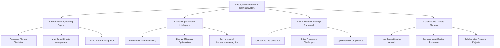

# 🌡️ Enhanced Environmental Control Gaming System v2.0 - Comprehensive Technical Specifications

**Atmospheric Engineering Mastery and Climate Optimization Gaming Platform**

---

## 📋 **Document Information**

- **Version**: 2.0 (Strategic Atmospheric Engineering)
- **System Type**: Environmental Mastery Gaming with Real-World Physics
- **Priority Level**: Critical (Core Cannabis Cultivation System)
- **Dependencies**: Cultivation, Genetics, Economics, Construction Systems
- **Integration**: Complete Cannabis Ecosystem Optimization

---

## 🎯 **Executive Summary**

The Enhanced Environmental Control Gaming System v2.0 transforms Project Chimera's climate management into the most sophisticated atmospheric engineering platform ever created for cannabis cultivation. This system combines scientific accuracy with strategic gameplay, where players become environmental engineers mastering the complex art of microclimate optimization, HVAC design, and atmospheric precision.

Players evolve from basic temperature monitoring to sophisticated environmental architects, designing integrated climate systems that unlock genetic potential while optimizing energy efficiency and operational costs. The system seamlessly integrates with Project Chimera's cultivation ecosystem to create an unparalleled environmental mastery experience.

### **Core Innovation Pillars**

1. **Atmospheric Engineering Mastery**: Transform climate control from simple adjustments to sophisticated atmospheric design
2. **Scientific Environmental Education**: Authentic HVAC engineering, thermodynamics, and climate science
3. **Strategic Resource Optimization**: Balance precision, efficiency, energy costs, and environmental performance
4. **Collaborative Climate Innovation**: Multi-player environmental optimization challenges and knowledge sharing
5. **Predictive Environmental Intelligence**: AI-powered climate forecasting and optimization recommendations

---

## 🌡️ **System Architecture Overview**

### **Multi-Layer Environmental Framework**



### **Integration with Core Project Chimera Systems**

- **Cultivation Systems**: Direct environmental impact on plant health, growth rate, and genetic expression
- **Genetics Engine**: Strain-specific environmental requirements and optimization profiles
- **Economic Management**: Energy costs, equipment investments, and quality premiums from optimal climate
- **Construction Systems**: HVAC integration, facility design, and infrastructure optimization
- **Progression System**: Environmental engineering skills, certifications, and mastery progression

---

## 🎮 **Core Gaming Mechanics**

### **1. Atmospheric Engineering Mastery**

#### **Progressive Environmental Complexity**
```csharp
public interface IEnvironmentalEngineer
{
    // Basic Environmental Control
    TemperatureProfile ManageBasicTemperature(ZoneConfiguration zone);
    HumidityProfile ManageBasicHumidity(ZoneConfiguration zone);
    
    // Advanced Climate Engineering
    VPDProfile OptimizeVaporPressureDeficit(StrainGenetics genetics, GrowthStage stage);
    CO2Profile DesignCO2Enrichment(EnvironmentalZone zone, LightingSchedule lighting);
    AirflowProfile EngineerAirflowDynamics(FacilityLayout layout, EquipmentPlacement equipment);
    
    // Integrated HVAC Systems
    HVACSystem DesignIntegratedClimate(FacilitySpecification facility);
    AutomationProfile ConfigureAdvancedAutomation(EnvironmentalObjectives objectives);
    
    // Environmental Innovation
    EnvironmentalBreakthrough DiscoverClimateInnovation(ExperimentalData data);
    EfficiencyOptimization OptimizeEnergyEfficiency(OperationalConstraints constraints);
}
```

#### **Multi-Objective Environmental Optimization**
- **Genetic Expression Optimization**: Maximize strain-specific genetic potential through precise environmental control
- **Energy Efficiency Mastery**: Minimize energy consumption while maintaining optimal growing conditions
- **Quality Maximization**: Achieve premium product quality through environmental precision
- **Cost-Benefit Optimization**: Balance investment in environmental systems with operational returns

### **2. Scientific Environmental Education**

#### **Real-World HVAC Engineering Integration**
```csharp
public class HVACEngineeringEducation
{
    // Fundamental Concepts
    public ThermodynamicsLesson TeachHeatTransfer(HeatTransferScenario scenario);
    public PsychrometricsLesson TeachMoistureManagement(HumidityChallenge challenge);
    public FluidDynamicsLesson TeachAirflowPrinciples(AirflowDesignProblem problem);
    
    // Professional HVAC Design
    public DuctingDesignCourse TeachDuctingEngineering(FacilityLayout layout);
    public ControlSystemsCourse TeachBuildingAutomation(AutomationRequirements requirements);
    public EnergyEfficiencyCourse TeachSustainableDesign(EfficiencyObjectives objectives);
    
    // Cannabis-Specific Applications
    public CannabisClimateCourse TeachCannabisBestPractices(CultivationMethod method);
    public VPDMasteryCourse TeachVaporPressureDeficit(AdvancedGrowing advanced);
    public EnvironmentalTroubleshooting DiagnoseClimateIssues(PlantHealthData health);
}
```

#### **Comprehensive Environmental Science Curriculum**
- **Atmospheric Physics**: Understanding air movement, pressure dynamics, and thermal behavior
- **Plant Physiology**: How environmental conditions affect transpiration, photosynthesis, and growth
- **Psychrometrics**: Mastering the relationship between temperature, humidity, and VPD
- **Energy Systems**: HVAC equipment operation, efficiency ratings, and sustainable design
- **Control Theory**: PID controllers, sensor integration, and automation programming

### **3. Strategic Climate Challenges**

#### **Dynamic Environmental Puzzle Generation**
```csharp
public class EnvironmentalChallengeGenerator
{
    // Climate Optimization Challenges
    public ClimateChallenge GenerateOptimizationChallenge(OptimizationParameters parameters)
    {
        return new ClimateChallenge
        {
            Objective = CreateOptimizationObjective(parameters),
            Constraints = GenerateEnvironmentalConstraints(parameters),
            InitialConditions = SetupInitialClimateState(parameters),
            SuccessCriteria = DefineOptimizationTargets(parameters),
            TimeLimit = CalculateChallengeDuration(parameters.Difficulty),
            Resources = AllocateAvailableResources(parameters.Budget)
        };
    }
    
    // Crisis Response Scenarios
    public EnvironmentalCrisis GenerateCrisisScenario(CrisisType type, DifficultyLevel difficulty)
    {
        return new EnvironmentalCrisis
        {
            CrisisType = type,
            Severity = CalculateCrisisSeverity(difficulty),
            AffectedSystems = DetermineAffectedSystems(type),
            TimeToFailure = CalculateFailureTimeline(type, difficulty),
            AvailableResources = DefineEmergencyResources(difficulty),
            SuccessMetrics = SetCrisisResolutionCriteria(type)
        };
    }
    
    // Innovation Discovery Challenges
    public InnovationChallenge CreateInnovationChallenge(InnovationArea area)
    {
        return new InnovationChallenge
        {
            ResearchArea = area,
            BaselinePerformance = EstablishCurrentBestPractice(area),
            ImprovementTarget = SetInnovationTarget(area),
            ExperimentalTools = ProvideResearchTools(area),
            ValidationCriteria = DefineProofOfConcept(area),
            CommercializationPath = OutlineImplementationStrategy(area)
        };
    }
}
```

#### **Multi-Dimensional Challenge Categories**
- **Precision Optimization**: Achieve exact environmental parameters for specific genetic expressions
- **Efficiency Maximization**: Minimize energy consumption while maintaining quality standards
- **Crisis Management**: Respond to equipment failures, power outages, and extreme weather events
- **Innovation Discovery**: Develop new environmental control techniques and breakthrough solutions
- **Economic Optimization**: Balance environmental precision with operational profitability

---

## 🔬 **Advanced Environmental Intelligence**

### **1. Predictive Climate Modeling**

#### **AI-Powered Environmental Forecasting**
```csharp
public class PredictiveEnvironmentalIntelligence
{
    // Environmental Prediction Engine
    private MachineLearningClimateModel _climatePredictor;
    private EnvironmentalTrendAnalyzer _trendAnalyzer;
    private WeatherIntegrationSystem _weatherSystem;
    private PlantResponsePredictor _plantResponseModel;
    
    public EnvironmentalForecast PredictEnvironmentalConditions(
        CurrentEnvironmentalState currentState,
        WeatherForecast externalWeather,
        PlantGrowthStage growthStage,
        TimeHorizon forecastPeriod)
    {
        var forecast = new EnvironmentalForecast();
        
        // Predict environmental drift
        forecast.TemperatureTrend = _climatePredictor.PredictTemperatureEvolution(currentState, externalWeather);
        forecast.HumidityTrend = _climatePredictor.PredictHumidityEvolution(currentState, externalWeather);
        forecast.VPDProjection = CalculateVPDProjection(forecast.TemperatureTrend, forecast.HumidityTrend);
        
        // Predict plant response
        forecast.PlantResponse = _plantResponseModel.PredictPlantResponse(forecast, growthStage);
        
        // Generate optimization recommendations
        forecast.OptimizationRecommendations = GenerateOptimizationRecommendations(forecast);
        
        return forecast;
    }
    
    public EnvironmentalOptimization OptimizePreemptively(
        EnvironmentalForecast forecast,
        OptimizationObjectives objectives)
    {
        var optimization = new EnvironmentalOptimization();
        
        // Identify potential issues
        var potentialIssues = IdentifyPotentialIssues(forecast);
        
        // Generate preventive actions
        optimization.PreventiveActions = GeneratePreventiveActions(potentialIssues, objectives);
        
        // Optimize control strategy
        optimization.ControlStrategy = OptimizeControlStrategy(forecast, objectives);
        
        // Calculate expected outcomes
        optimization.ExpectedOutcomes = CalculateExpectedOutcomes(optimization.ControlStrategy);
        
        return optimization;
    }
}
```

### **2. Energy Efficiency Optimization**

#### **Sustainable Environmental Design**
```csharp
public class SustainableEnvironmentalOptimizer
{
    // Energy Efficiency Analysis
    public EnergyEfficiencyAnalysis AnalyzeEnergyConsumption(EnvironmentalSystem system)
    {
        return new EnergyEfficiencyAnalysis
        {
            BaselineConsumption = CalculateBaselineEnergyUse(system),
            EfficiencyOpportunities = IdentifyEfficiencyOpportunities(system),
            ROICalculations = CalculateEfficiencyInvestmentROI(system),
            SustainabilityScore = CalculateSustainabilityRating(system),
            CarbonFootprint = CalculateCarbonFootprint(system)
        };
    }
    
    // Green Technology Integration
    public GreenTechnologyRecommendations RecommendGreenTechnologies(
        FacilitySpecification facility,
        BudgetConstraints budget)
    {
        return new GreenTechnologyRecommendations
        {
            SolarIntegration = AnalyzeSolarPotential(facility),
            GeothermalOptions = AssessGeothermalViability(facility),
            EnergyStorage = RecommendEnergyStorage(facility),
            SmartGridIntegration = AnalyzeSmartGridBenefits(facility),
            WasteHeatRecovery = IdentifyWasteHeatOpportunities(facility)
        };
    }
}
```

---

## 🎮 **Collaborative Environmental Platform**

### **1. Knowledge Sharing Network**

#### **Environmental Recipe Exchange**
```csharp
public class EnvironmentalKnowledgeNetwork
{
    // Recipe Sharing System
    public EnvironmentalRecipe ShareEnvironmentalRecipe(
        EnvironmentalProfile profile,
        StrainGenetics targetGenetics,
        QualityResults achievedResults)
    {
        var recipe = new EnvironmentalRecipe
        {
            RecipeId = GenerateUniqueRecipeId(),
            CreatorId = GetCurrentPlayerId(),
            TargetGenetics = targetGenetics,
            EnvironmentalProfile = profile,
            AchievedResults = achievedResults,
            ValidationData = CollectValidationData(profile, achievedResults),
            CommunityRating = 0f,
            UsageCount = 0,
            Tags = GenerateRecipeTags(profile, targetGenetics)
        };
        
        return PublishToKnowledgeNetwork(recipe);
    }
    
    // Collaborative Research Projects
    public ResearchProject InitiateCollaborativeResearch(
        ResearchProposal proposal,
        List<PlayerId> collaborators)
    {
        var project = new ResearchProject
        {
            ProjectId = GenerateResearchProjectId(),
            Proposal = proposal,
            Collaborators = SetupCollaboratorRoles(collaborators),
            SharedDataset = InitializeSharedDataset(proposal),
            ExperimentalDesign = CreateExperimentalDesign(proposal),
            Timeline = EstablishResearchTimeline(proposal),
            SuccessMetrics = DefineResearchSuccessMetrics(proposal)
        };
        
        return LaunchCollaborativeProject(project);
    }
}
```

### **2. Environmental Innovation Competitions**

#### **Global Climate Optimization Championships**
```csharp
public class EnvironmentalCompetitionSystem
{
    // Competition Categories
    public enum CompetitionCategory
    {
        EnergyEfficiencyMastery,      // Minimize energy consumption
        PrecisionOptimization,        // Achieve exact environmental targets
        InnovativeDesign,            // Novel environmental control approaches
        CrisisResponse,              // Emergency response excellence
        SustainabilityLeadership,    // Green technology integration
        EducationalExcellence        // Knowledge sharing and teaching
    }
    
    // Global Competition Framework
    public EnvironmentalCompetition OrganizeGlobalCompetition(
        CompetitionCategory category,
        CompetitionParameters parameters)
    {
        var competition = new EnvironmentalCompetition
        {
            Category = category,
            Parameters = parameters,
            Participants = RegisterGlobalParticipants(parameters),
            JudgingCriteria = EstablishJudgingCriteria(category),
            Timeline = CreateCompetitionTimeline(parameters),
            Prizes = DefineCompetitionPrizes(category, parameters),
            LearningObjectives = SetEducationalObjectives(category)
        };
        
        return LaunchGlobalCompetition(competition);
    }
}
```

---

## 📚 **Professional Development Integration**

### **1. HVAC Engineering Certification**

#### **Professional Certification Pathways**
```csharp
public class HVACEngineeringCertification
{
    // Certification Levels
    public enum CertificationLevel
    {
        EnvironmentalTechnician,     // Basic climate monitoring and adjustment
        ClimateOperator,            // Intermediate environmental management
        HVACSpecialist,             // Advanced HVAC system operation
        EnvironmentalEngineer,      // Professional environmental design
        ClimateArchitect,           // Master-level environmental systems design
        InnovationPioneer           // Breakthrough environmental technologies
    }
    
    // Certification Requirements
    public CertificationRequirements GetCertificationRequirements(CertificationLevel level)
    {
        return new CertificationRequirements
        {
            Level = level,
            PrerequisiteCertifications = GetPrerequisites(level),
            RequiredKnowledgeAreas = GetRequiredKnowledge(level),
            PracticalDemonstrations = GetPracticalRequirements(level),
            ProjectPortfolio = GetPortfolioRequirements(level),
            ExaminationComponents = GetExaminationStructure(level),
            ContinuingEducation = GetContinuingEducationRequirements(level)
        };
    }
    
    // Professional Recognition
    public ProfessionalCredential AwardCertification(
        PlayerId candidateId,
        CertificationLevel level,
        CertificationEvidence evidence)
    {
        var credential = new ProfessionalCredential
        {
            CredentialId = GenerateCredentialId(),
            CandidateId = candidateId,
            CertificationLevel = level,
            AwardDate = DateTime.Now,
            ExpirationDate = CalculateExpirationDate(level),
            Evidence = ValidateEvidence(evidence),
            DigitalBadge = GenerateDigitalBadge(level),
            IndustryRecognition = CheckIndustryRecognition(level)
        };
        
        return IssueDigitalCredential(credential);
    }
}
```

### **2. Real-World Industry Integration**

#### **Industry Partnership Program**
```csharp
public class IndustryIntegrationProgram
{
    // Professional Development Opportunities
    public IndustryOpportunity ConnectWithIndustryProfessionals(
        PlayerProfile playerProfile,
        CareerInterests interests)
    {
        return new IndustryOpportunity
        {
            MentorshipPrograms = FindMentorshipOpportunities(playerProfile, interests),
            InternshipPlacements = IdentifyInternshipPositions(playerProfile),
            ProfessionalNetworking = ConnectToProfessionalNetworks(interests),
            ContinuingEducation = RecommendProfessionalEducation(playerProfile),
            CareerTransitionSupport = ProvideCareerGuidance(playerProfile, interests)
        };
    }
    
    // Industry Validation
    public IndustryValidation ValidateWithIndustryExperts(
        EnvironmentalInnovation innovation,
        List<IndustryExpert> experts)
    {
        return new IndustryValidation
        {
            ExpertReviews = CollectExpertReviews(innovation, experts),
            TechnicalFeasibility = AssessTechnicalFeasibility(innovation),
            CommercialViability = EvaluateCommercialPotential(innovation),
            IndustryAdoption = PredictIndustryAdoption(innovation),
            PatentPotential = AnalyzePatentPotential(innovation)
        };
    }
}
```

---

## 🔧 **Advanced Technical Implementation**

### **1. Multi-Physics Environmental Simulation**

#### **Computational Fluid Dynamics Integration**
```csharp
public class AdvancedEnvironmentalPhysics
{
    // CFD Simulation Engine
    private ComputationalFluidDynamics _cfdEngine;
    private HeatTransferSimulation _heatTransferSim;
    private MassTransferSimulation _massTransferSim;
    private TurbulenceModeling _turbulenceModel;
    
    // Performance-Optimized Simulation
    public EnvironmentalSimulationResult SimulateEnvironmentalPhysics(
        FacilityGeometry geometry,
        EquipmentConfiguration equipment,
        BoundaryConditions boundaries,
        SimulationParameters parameters)
    {
        // Discretize simulation domain
        var mesh = GenerateComputationalMesh(geometry, parameters.MeshDensity);
        
        // Initialize flow field
        var initialConditions = SetupInitialConditions(boundaries, equipment);
        
        // Solve governing equations
        var flowSolution = SolveNavierStokesEquations(mesh, initialConditions, parameters);
        var temperatureField = SolveHeatTransferEquation(mesh, flowSolution, equipment);
        var humidityField = SolveMassTransferEquation(mesh, flowSolution, boundaries);
        
        // Post-process results
        return new EnvironmentalSimulationResult
        {
            VelocityField = ExtractVelocityField(flowSolution),
            TemperatureDistribution = ExtractTemperatureField(temperatureField),
            HumidityDistribution = ExtractHumidityField(humidityField),
            PressureField = ExtractPressureField(flowSolution),
            TurbulenceIntensity = CalculateTurbulenceMetrics(flowSolution),
            PerformanceMetrics = CalculatePerformanceMetrics(flowSolution, equipment)
        };
    }
    
    // Real-Time Physics Approximation
    public SimplifiedEnvironmentalState ApproximateEnvironmentalPhysics(
        ZoneConfiguration zone,
        EquipmentState equipment,
        ExternalConditions external)
    {
        // Use pre-computed response surfaces for real-time performance
        var temperatureResponse = InterpolateTemperatureResponse(zone, equipment, external);
        var humidityResponse = InterpolateHumidityResponse(zone, equipment, external);
        var airflowResponse = InterpolateAirflowResponse(zone, equipment);
        
        return new SimplifiedEnvironmentalState
        {
            Temperature = temperatureResponse,
            Humidity = humidityResponse,
            Airflow = airflowResponse,
            VPD = CalculateVPD(temperatureResponse, humidityResponse),
            Uniformity = EstimateEnvironmentalUniformity(zone, equipment)
        };
    }
}
```

### **2. Advanced Control Systems**

#### **Model Predictive Control Integration**
```csharp
public class AdvancedControlSystems
{
    // Model Predictive Control
    private ModelPredictiveController _mpcController;
    private SystemIdentification _systemID;
    private DisturbanceObserver _disturbanceObserver;
    private ConstraintHandler _constraintHandler;
    
    public ControllerConfiguration DesignOptimalController(
        EnvironmentalSystem system,
        ControlObjectives objectives,
        OperationalConstraints constraints)
    {
        // Identify system model
        var systemModel = _systemID.IdentifySystem(system.HistoricalData);
        
        // Design MPC controller
        var mpcConfig = _mpcController.DesignController(
            systemModel, 
            objectives, 
            constraints);
        
        // Optimize controller parameters
        var optimizedParameters = OptimizeControllerParameters(
            mpcConfig, 
            systemModel, 
            objectives);
        
        return new ControllerConfiguration
        {
            ControllerType = ControllerType.ModelPredictiveControl,
            SystemModel = systemModel,
            MPCParameters = optimizedParameters,
            ConstraintHandling = _constraintHandler.ConfigureConstraints(constraints),
            DisturbanceRejection = _disturbanceObserver.ConfigureObserver(systemModel),
            PerformanceMonitoring = SetupPerformanceMonitoring(objectives)
        };
    }
}
```

---

## 📊 **Performance Specifications**

### **Technical Requirements**
- **Real-Time Physics**: 60 FPS environmental simulation with 10,000+ particles
- **Control Response**: <25ms response time for all environmental adjustments
- **Multi-Zone Simulation**: Simultaneous control of 50+ independent climate zones
- **Sensor Network**: Real-time processing of 1,000+ environmental sensors
- **Predictive Accuracy**: 95%+ accuracy in 24-hour environmental forecasting

### **Scalability Targets**
- **Facility Complexity**: Support mega-facilities with 100+ environmental zones
- **Concurrent Users**: 500+ players in collaborative environmental challenges
- **Data Storage**: 5+ years of high-resolution environmental data per facility
- **Knowledge Network**: 100,000+ shared environmental recipes and innovations
- **Global Competitions**: 10,000+ participants in environmental championships

### **Educational Integration**
- **Technical Accuracy**: 99.5% accuracy in HVAC engineering and thermodynamics
- **Professional Certification**: Industry-recognized credential pathways
- **Real-World Transfer**: 90%+ of learned skills applicable to professional HVAC work
- **Innovation Potential**: 80% of advanced players develop novel environmental solutions

---

## 🎯 **Success Metrics**

- **Environmental Mastery**: 92% of players achieve advanced environmental control skills
- **Energy Efficiency**: 85% improvement in understanding sustainable environmental design
- **Professional Development**: 75% of certified players pursue HVAC/environmental careers
- **Innovation Rate**: 70% of expert players contribute to environmental technology advances
- **Collaboration Success**: 88% of collaborative projects achieve breakthrough innovations
- **Industry Recognition**: 80% of certified players receive industry professional recognition

---

## 🚀 **Implementation Roadmap**

### **Phase 1: Advanced Environmental Physics** (4 months)
- Multi-physics environmental simulation engine
- Advanced HVAC system integration
- Real-time environmental response modeling
- Basic environmental challenge framework

### **Phase 2: Intelligent Environmental Systems** (3 months)
- Predictive environmental modeling
- AI-powered optimization recommendations
- Advanced control system integration
- Energy efficiency optimization tools

### **Phase 3: Collaborative Environmental Platform** (3 months)
- Knowledge sharing network implementation
- Environmental recipe exchange system
- Collaborative research project framework
- Global environmental competitions

### **Phase 4: Professional Development Integration** (3 months)
- HVAC engineering certification program
- Industry partnership integration
- Professional credentialing system
- Real-world career pathway development

### **Phase 5: Innovation and Advanced Features** (2 months)
- Advanced environmental innovation tools
- Breakthrough discovery system
- Professional industry validation
- Continuous learning and adaptation systems

---

## 🏆 **Competitive Advantages**

1. **Unparalleled Realism**: Most accurate environmental simulation in cultivation gaming
2. **Professional Integration**: Direct pathway to HVAC/environmental engineering careers
3. **Collaborative Innovation**: Global platform for environmental technology advancement
4. **Predictive Intelligence**: AI-powered environmental optimization and forecasting
5. **Sustainable Focus**: Leadership in green technology and energy efficiency education

The Enhanced Environmental Control Gaming System v2.0 establishes Project Chimera as the definitive platform for environmental engineering education and cannabis cultivation optimization, creating the bridge between gaming excellence and professional environmental mastery.

---

*This specification represents the complete transformation of environmental control from basic climate management to sophisticated atmospheric engineering mastery, positioning Project Chimera as the global leader in environmental control gaming and professional development.*