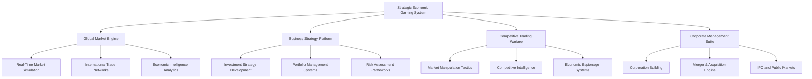

# 💰 Enhanced Economic Gaming System v2.0 - Comprehensive Technical Specifications

**Global Cannabis Economic Mastery and Financial Strategy Platform**

---

## 📋 **Document Information**

- **Version**: 2.0 (Strategic Economic Mastery)
- **System Type**: Economic Gaming with Real-World Financial Education
- **Priority Level**: Critical (Core Business Strategy System)
- **Dependencies**: Cultivation, Genetics, Facilities, Progression Systems
- **Integration**: Complete Cannabis Ecosystem Economic Optimization

---

## 🎯 **Executive Summary**

The Enhanced Economic Gaming System v2.0 transforms Project Chimera's economic elements into the most sophisticated cannabis business simulation platform ever created. This system combines authentic financial education with strategic gameplay, where players evolve from hobbyist growers to global cannabis industry leaders through mastering complex economic dynamics, competitive market warfare, and collaborative business ventures.

Players progress from basic contract fulfillment to sophisticated investment strategies, international trade operations, and corporate empire building while learning real-world financial skills that transfer directly to professional business environments.

### **Core Innovation Pillars**

1. **Global Economic Mastery**: Transform from local grower to international cannabis industry leader
2. **Financial Education Excellence**: Authentic business and financial education with real-world application
3. **Strategic Market Warfare**: Competitive trading, market manipulation, and business intelligence
4. **Collaborative Economics**: Corporate structures, joint ventures, and global consortium building
5. **Professional Business Development**: Direct pathway to finance, business strategy, and entrepreneurship careers

---

## 💼 **System Architecture Overview**

### **Multi-Layer Economic Framework**



### **Integration with Core Project Chimera Systems**

- **Cultivation Systems**: Direct economic impact from cultivation quality, efficiency, and innovation
- **Genetics Engine**: Genetic rarity and quality directly affects market value and competitive advantage
- **Facility Management**: Infrastructure investments affect operational efficiency and market position
- **Environmental Control**: Optimization reduces costs and increases product quality premiums
- **Construction Systems**: Facility expansion enables business scaling and new market opportunities
- **Progression System**: Business skills, financial expertise, and economic mastery progression

---

## 🎮 **Core Gaming Mechanics**

### **1. Progressive Economic Complexity**

#### **Economic Evolution Pathway**
```csharp
public interface IEconomicEvolution
{
    // Foundation Phase: Hobbyist Economics
    ContractFulfillment ManageBasicContracts(NPCContract contract);
    OperationalCosts TrackBasicExpenses(FacilityOperations operations);
    QualityPricing UnderstandQualityValue(ProductQuality quality);
    
    // Growth Phase: Business Development
    MarketAnalysis AnalyzeSupplyDemand(MarketSegment segment);
    InvestmentStrategy DevelopInvestmentPlan(BusinessObjectives objectives);
    BrandBuilding EstablishMarketPresence(BrandStrategy strategy);
    
    // Professional Phase: Market Mastery
    PortfolioManagement OptimizeInvestmentPortfolio(RiskProfile profile);
    CompetitiveIntelligence AnalyzeCompetitors(MarketCompetitors competitors);
    GlobalExpansion EnterInternationalMarkets(GlobalStrategy strategy);
    
    // Expert Phase: Industry Leadership
    CorporateStrategy BuildBusinessEmpire(CorporateVision vision);
    MergerAcquisition ExecuteCorporateDeals(AcquisitionTargets targets);
    MarketManipulation InfluenceGlobalMarkets(ManipulationStrategy strategy);
    
    // Master Phase: Economic Innovation
    IndustryDisruption CreateMarketRevolution(DisruptionTechnology technology);
    EconomicThought DevelopNewTheories(EconomicPhilosophy philosophy);
    GlobalInfluence ShapeIndustryStandards(IndustryLeadership leadership);
}
```

#### **Multi-Dimensional Economic Optimization**
- **Quality Premium Maximization**: Achieve premium pricing through superior product quality
- **Operational Efficiency Mastery**: Minimize costs while maintaining quality standards
- **Market Timing Excellence**: Buy low, sell high through predictive market analysis
- **Portfolio Diversification**: Balance risk across multiple market segments and asset classes
- **Innovation Investment**: R&D investments that create competitive advantages and new markets

### **2. Real-World Financial Education Integration**

#### **Comprehensive Business Curriculum**
```csharp
public class FinancialEducationPlatform
{
    // Fundamental Business Concepts
    public AccountingFundamentals TeachFinancialStatements(BusinessScenario scenario);
    public CashFlowManagement TeachCashFlowAnalysis(OperationalData data);
    public BudgetingSkills TeachBudgetPlanning(BusinessPlanning planning);
    
    // Investment and Portfolio Theory
    public ModernPortfolioTheory TeachRiskReturn(InvestmentScenarios scenarios);
    public AssetValuation TeachValuationMethods(AssetClasses assets);
    public DerivativesTrading TeachAdvancedInstruments(TradingStrategies strategies);
    
    // Corporate Finance
    public CapitalStructure TeachFinancingDecisions(CorporateFinance finance);
    public MergerAcquisition TeachCorporateStrategy(StrategicOptions options);
    public IPOProcess TeachPublicMarkets(PublicOffering offering);
    
    // International Business
    public CurrencyTrading TeachForexMarkets(CurrencyPairs pairs);
    public InternationalTrade TeachGlobalCommerce(TradeAgreements agreements);
    public GeopoliticalRisk TeachGlobalRiskAssessment(GeopoliticalFactors factors);
    
    // Advanced Financial Engineering
    public StructuredProducts TeachComplexInstruments(FinancialInnovation innovation);
    public AlgorithmicTrading TeachQuantitativeFinance(TradingAlgorithms algorithms);
    public RiskManagement TeachAdvancedRiskModels(RiskFrameworks frameworks);
}
```

#### **Professional Certification Pathways**
- **Business Fundamentals**: Basic accounting, budgeting, cash flow management
- **Investment Analysis**: Portfolio theory, asset valuation, risk assessment
- **Corporate Strategy**: M&A analysis, capital structure, strategic planning
- **International Finance**: Global markets, currency trading, geopolitical analysis
- **Quantitative Finance**: Algorithmic trading, financial modeling, derivatives
- **Entrepreneurship**: Startup development, venture capital, business plan creation

### **3. Strategic Market Warfare**

#### **Competitive Business Intelligence Platform**
```csharp
public class MarketWarfareEngine
{
    // Intelligence Gathering
    public CompetitorAnalysis AnalyzeCompetitorOperations(CompetitorTargets targets)
    {
        return new CompetitorAnalysis
        {
            OperationalEfficiency = AssessCompetitorEfficiency(targets),
            ProductQuality = AnalyzeCompetitorProducts(targets),
            MarketPosition = EvaluateMarketPosition(targets),
            FinancialHealth = AssessFinancialStrength(targets),
            StrategicVulnerabilities = IdentifyWeaknesses(targets),
            GrowthTrajectory = PredictCompetitorGrowth(targets)
        };
    }
    
    // Strategic Attacks
    public MarketAttackCampaign LaunchMarketAttack(AttackStrategy strategy)
    {
        return new MarketAttackCampaign
        {
            PriceWarfare = ExecutePriceAttack(strategy.PriceStrategy),
            SupplyDisruption = DisruptSupplyChains(strategy.SupplyStrategy),
            QualityCompetition = LaunchQualityOffensive(strategy.QualityStrategy),
            InnovationRace = AccelerateInnovation(strategy.InnovationStrategy),
            TalentPoaching = RecruitCompetitorTalent(strategy.TalentStrategy),
            MarketShare = CaptureMarketShare(strategy.ExpansionStrategy)
        };
    }
    
    // Defensive Strategies
    public DefensiveMeasures ImplementDefensiveStrategy(DefenseStrategy strategy)
    {
        return new DefensiveMeasures
        {
            CompetitiveMonitoring = SetupEarlyWarning(strategy.MonitoringLevel),
            MarketProtection = ProtectKeyMarkets(strategy.ProtectionAreas),
            CustomersRetention = ImplementLoyaltyPrograms(strategy.RetentionStrategy),
            InnovationAcceleration = AccelerateR&D(strategy.InnovationPriorities),
            StrategicAlliances = FormDefensiveAlliances(strategy.AllianceTargets),
            CrisisResponse = PrepareContingencyPlans(strategy.CrisisScenarios)
        };
    }
    
    // Economic Espionage (Ethical Game Mechanics)
    public IntelligenceOperation ConductIntelligenceOperation(IntelligenceTarget target)
    {
        return new IntelligenceOperation
        {
            MarketResearch = GatherPublicMarketData(target),
            CompetitiveAnalysis = AnalyzePublicFinancials(target),
            IndustryNetworking = BuildIntelligenceNetwork(target),
            TechnologyScanning = MonitorPatentFilings(target),
            TalentTracking = TrackExecutiveMovements(target),
            SupplierIntelligence = AnalyzeSupplierRelationships(target)
        };
    }
}
```

#### **Market Manipulation Mechanics**
- **Supply Control**: Cornering markets on rare genetics or specialized equipment
- **Demand Engineering**: Creating artificial demand through marketing and strategic partnerships
- **Price Leadership**: Setting market prices through dominant market position
- **Information Asymmetry**: Using superior market intelligence for competitive advantage
- **Network Effects**: Building platform dominance through ecosystem control
- **Innovation Cycles**: Timing product releases to disrupt competitor launches

---

## 🌍 **Global Economic Simulation**

### **1. Real-Time International Markets**

#### **Multi-Regional Cannabis Economy**
```csharp
public class GlobalCannabisMarkets
{
    // Regional Market Systems
    private Dictionary<Region, RegionalMarket> _regionalMarkets = new Dictionary<Region, RegionalMarket>
    {
        [Region.NorthAmerica] = new RegionalMarket
        {
            LegalFramework = LegalStatus.FullyLegal,
            MarketMaturity = MaturityLevel.Established,
            RegulationComplexity = RegulationLevel.Moderate,
            TaxStructure = TaxFramework.StateVaried,
            CompetitionLevel = CompetitionIntensity.High,
            ConsumerSophistication = SophisticationLevel.Advanced
        },
        [Region.Europe] = new RegionalMarket
        {
            LegalFramework = LegalStatus.Medical_Recreational_Varied,
            MarketMaturity = MaturityLevel.Emerging,
            RegulationComplexity = RegulationLevel.High,
            TaxStructure = TaxFramework.CountrySpecific,
            CompetitionLevel = CompetitionIntensity.Moderate,
            ConsumerSophistication = SophisticationLevel.Intermediate
        },
        [Region.Asia] = new RegionalMarket
        {
            LegalFramework = LegalStatus.Restricted_Medical,
            MarketMaturity = MaturityLevel.EarlyStage,
            RegulationComplexity = RegulationLevel.VeryHigh,
            TaxStructure = TaxFramework.Prohibitive,
            CompetitionLevel = CompetitionIntensity.Low,
            ConsumerSophistication = SophisticationLevel.Basic
        }
    };
    
    public GlobalMarketAnalysis AnalyzeGlobalOpportunities(ExpansionStrategy strategy)
    {
        var analysis = new GlobalMarketAnalysis();
        
        foreach (var market in _regionalMarkets)
        {
            analysis.RegionalOpportunities[market.Key] = new MarketOpportunity
            {
                MarketSize = CalculateMarketSize(market.Value),
                GrowthPotential = AssessGrowthPotential(market.Value),
                RegulatoryRisk = EvaluateRegulatoryRisk(market.Value),
                CompetitiveIntensity = AssessCompetition(market.Value),
                EntryBarriers = AnalyzeEntryBarriers(market.Value),
                ProfitPotential = EstimateProfitability(market.Value, strategy)
            };
        }
        
        return analysis;
    }
    
    public InternationalExpansion ExecuteGlobalExpansion(GlobalStrategy strategy)
    {
        return new InternationalExpansion
        {
            MarketEntry = ExecuteMarketEntry(strategy.TargetMarkets),
            RegulatoryCompliance = EnsureCompliance(strategy.ComplianceStrategy),
            LocalPartnerships = EstablishPartnerships(strategy.PartnershipStrategy),
            SupplyChainGlobal = BuildGlobalSupplyChain(strategy.LogisticsStrategy),
            BrandLocalization = LocalizeBrand(strategy.BrandStrategy),
            RevenueRepatriation = ManageCurrencyRisk(strategy.FinancialStrategy)
        };
    }
}
```

### **2. Advanced Economic Intelligence**

#### **Predictive Market Analytics Engine**
```csharp
public class EconomicIntelligenceEngine
{
    // Market Prediction Systems
    private MachineLearningMarketPredictor _marketPredictor;
    private EconomicIndicatorAnalyzer _indicatorAnalyzer;
    private GeopoliticalEventProcessor _geopoliticalProcessor;
    private RegulatoryChangePredictor _regulatoryPredictor;
    private ConsumerBehaviorAnalyzer _consumerAnalyzer;
    
    public MarketForecast GenerateMarketForecast(ForecastParameters parameters)
    {
        var forecast = new MarketForecast();
        
        // Analyze economic indicators
        forecast.EconomicTrends = _indicatorAnalyzer.AnalyzeTrends(parameters.TimeHorizon);
        
        // Process geopolitical factors
        forecast.GeopoliticalImpact = _geopoliticalProcessor.AssessImpact(parameters.Regions);
        
        // Predict regulatory changes
        forecast.RegulatoryForecast = _regulatoryPredictor.PredictChanges(parameters.Jurisdictions);
        
        // Analyze consumer behavior
        forecast.ConsumerTrends = _consumerAnalyzer.PredictConsumerBehavior(parameters.Demographics);
        
        // Generate investment recommendations
        forecast.InvestmentRecommendations = GenerateInvestmentRecommendations(forecast);
        
        // Assess risk factors
        forecast.RiskAssessment = AnalyzeRiskFactors(forecast);
        
        return forecast;
    }
    
    public TradingSignals GenerateAutomatedTradingSignals(TradingStrategy strategy)
    {
        return new TradingSignals
        {
            TechnicalSignals = GenerateTechnicalAnalysis(strategy.TechnicalParameters),
            FundamentalSignals = GenerateFundamentalAnalysis(strategy.FundamentalParameters),
            SentimentSignals = AnalyzeMarketSentiment(strategy.SentimentParameters),
            ArbitrageOpportunities = IdentifyArbitrageOpportunities(strategy.ArbitrageParameters),
            RiskSignals = AssessRiskLevels(strategy.RiskParameters),
            ExecutionRecommendations = GenerateExecutionStrategy(strategy.ExecutionParameters)
        };
    }
}
```

### **3. Corporate Empire Building**

#### **Advanced Corporate Management Suite**
```csharp
public class CorporateEmpireBuilder
{
    // Corporate Structure Management
    public Corporation EstablishCorporation(CorporateFoundationPlan plan)
    {
        return new Corporation
        {
            LegalStructure = EstablishLegalEntity(plan.LegalFramework),
            GovernanceStructure = SetupGovernance(plan.GovernanceModel),
            OperationalStructure = BuildOperations(plan.OperationalPlan),
            FinancialStructure = DesignFinancialFramework(plan.FinancialStrategy),
            TechnologyPlatform = ImplementTechnologyStack(plan.TechnologyStrategy),
            HumanCapital = BuildTeam(plan.TalentStrategy)
        };
    }
    
    // Merger & Acquisition Engine
    public MergerAcquisition ExecuteMergerAcquisition(M&AStrategy strategy)
    {
        return new MergerAcquisition
        {
            TargetIdentification = IdentifyAcquisitionTargets(strategy.Criteria),
            DueDiligence = ConductDueDiligence(strategy.Targets),
            Valuation = PerformValuation(strategy.ValuationMethods),
            NegotiationStrategy = DevelopNegotiationApproach(strategy.NegotiationTactics),
            FinancingStructure = StructureFinancing(strategy.FinancingOptions),
            IntegrationPlan = PlanPostMergerIntegration(strategy.IntegrationStrategy),
            SynergyRealization = ImplementSynergies(strategy.SynergyTargets)
        };
    }
    
    // IPO and Public Markets
    public InitialPublicOffering ExecuteIPO(IPOStrategy strategy)
    {
        return new InitialPublicOffering
        {
            FinancialAudit = CompleteFinancialAudit(strategy.AuditRequirements),
            RegulatoryFiling = FileRegulatoryDocuments(strategy.RegulatoryStrategy),
            InvestorRelations = BuildInvestorBase(strategy.InvestorTargeting),
            PricingStrategy = DeterminePricing(strategy.PricingModel),
            Underwriting = SelectUnderwriters(strategy.UnderwriterCriteria),
            PublicTrading = LaunchPublicTrading(strategy.TradingStrategy),
            PostIPOManagement = ManagePublicCompany(strategy.PublicCompanyStrategy)
        };
    }
    
    // Global Expansion Engine
    public GlobalExpansion ExecuteGlobalExpansion(GlobalExpansionStrategy strategy)
    {
        return new GlobalExpansion
        {
            MarketAnalysis = AnalyzeGlobalMarkets(strategy.TargetMarkets),
            RegulatoryCompliance = NavigateGlobalRegulations(strategy.ComplianceFramework),
            JointVentures = EstablishJointVentures(strategy.PartnershipCriteria),
            AcquisitionTargets = IdentifyGlobalTargets(strategy.AcquisitionStrategy),
            TechnologyTransfer = ImplementTechnologyTransfer(strategy.TechnologyStrategy),
            BrandGlobalization = GlobalizeBrand(strategy.BrandStrategy),
            OperationalIntegration = IntegrateGlobalOperations(strategy.IntegrationPlan)
        };
    }
}
```

---

## 🤝 **Collaborative Economic Platform**

### **1. Corporate Consortium Building**

#### **Multi-Player Corporate Structures**
```csharp
public class CorporateConsortiumPlatform
{
    // Consortium Formation
    public BusinessConsortium EstablishConsortium(ConsortiumParameters parameters)
    {
        return new BusinessConsortium
        {
            ConsortiumId = GenerateConsortiumId(),
            FoundingMembers = parameters.FoundingMembers,
            GovernanceStructure = EstablishConsortiumGovernance(parameters.GovernanceModel),
            SharedResources = PoolResources(parameters.ResourceContributions),
            CollectiveBargaining = SetupBargainingPower(parameters.BargainingStrategy),
            RiskSharing = ImplementRiskSharingModel(parameters.RiskSharingFramework),
            ProfitDistribution = DesignProfitSharing(parameters.ProfitSharingModel),
            DecisionMaking = ImplementDecisionFramework(parameters.DecisionModel)
        };
    }
    
    // Joint Venture Management
    public JointVenture CreateJointVenture(JointVentureProposal proposal)
    {
        return new JointVenture
        {
            VentureId = GenerateVentureId(),
            Partners = proposal.Partners,
            BusinessObjective = proposal.Objective,
            ResourceAllocation = AllocatePartnerResources(proposal.ResourceContributions),
            GovernanceModel = EstablishJVGovernance(proposal.GovernanceStructure),
            IntellectualProperty = ManageIPRights(proposal.IPFramework),
            FinancialStructure = StructureJVFinancing(proposal.FinancialModel),
            ExitStrategy = DefinitExitTerms(proposal.ExitConditions)
        };
    }
    
    // Strategic Alliance Network
    public StrategicAlliance FormStrategicAlliance(AllianceStrategy strategy)
    {
        return new StrategicAlliance
        {
            AllianceType = strategy.AllianceType,
            PartnerNetwork = BuildPartnerNetwork(strategy.PartnerCriteria),
            CollaborationAreas = DefineCollaborationScope(strategy.CollaborationFramework),
            ResourceSharing = ImplementResourceSharing(strategy.SharingModel),
            KnowledgeExchange = FacilitateKnowledgeSharing(strategy.KnowledgeFramework),
            MarketAccess = EnableMarketAccess(strategy.MarketAccessTerms),
            CompetitiveAdvantage = CreateSharedAdvantages(strategy.AdvantageCreation)
        };
    }
}
```

### **2. Global Knowledge Exchange**

#### **Economic Intelligence Sharing Platform**
```csharp
public class EconomicKnowledgeNetwork
{
    // Research Collaboration
    public ResearchCollaboration InitiateResearchProject(ResearchProposal proposal)
    {
        return new ResearchCollaboration
        {
            ResearchId = GenerateResearchId(),
            Participants = proposal.ResearchTeam,
            ResearchObjective = proposal.Objective,
            Methodology = proposal.Methodology,
            ResourceRequirements = proposal.Resources,
            DataSharing = EstablishDataSharingProtocol(proposal.DataFramework),
            IntellectualProperty = NegotiateIPRights(proposal.IPTerms),
            PublicationRights = DefinePublicationTerms(proposal.PublicationStrategy),
            CommercializationPath = PlanCommercialization(proposal.CommercializationStrategy)
        };
    }
    
    // Market Intelligence Sharing
    public IntelligenceExchange ShareMarketIntelligence(IntelligenceSharing sharing)
    {
        return new IntelligenceExchange
        {
            IntelligenceType = sharing.IntelligenceCategory,
            SharedData = ProcessSharedIntelligence(sharing.Data),
            AccessPermissions = ManageAccessRights(sharing.AccessControlModel),
            QualityVerification = VerifyIntelligenceQuality(sharing.VerificationCriteria),
            CompensationModel = ImplementCompensation(sharing.CompensationFramework),
            ConfidentialityTerms = EnforceConfidentiality(sharing.ConfidentialityAgreement),
            UsageTracking = TrackIntelligenceUsage(sharing.UsageMonitoring)
        };
    }
    
    // Best Practices Exchange
    public BestPracticesExchange ShareBestPractices(PracticesSharing practices)
    {
        return new BestPracticesExchange
        {
            PracticeCategory = practices.Category,
            PracticeDescription = practices.Description,
            ImplementationGuide = practices.ImplementationFramework,
            SuccessMetrics = practices.PerformanceMetrics,
            CaseStudies = practices.CaseStudyData,
            CommunityValidation = ValidateWithCommunity(practices.ValidationCriteria),
            AdaptationGuidance = ProvideAdaptationAdvice(practices.AdaptationFramework)
        };
    }
}
```

---

## 📚 **Professional Business Development**

### **1. Business Education Certification**

#### **Comprehensive Business Skill Pathways**
```csharp
public class BusinessEducationPlatform
{
    // Certification Levels
    public enum BusinessCertificationLevel
    {
        BusinessFundamentals,        // Basic accounting, finance, operations
        OperationalManager,          // Process optimization, team management
        StrategicAnalyst,           // Market analysis, competitive intelligence
        InvestmentSpecialist,       // Portfolio management, risk assessment
        CorporateExecutive,         // Leadership, strategic planning, M&A
        IndustryInnovator           // Disruption, new market creation, thought leadership
    }
    
    // Certification Requirements
    public CertificationRequirements GetCertificationRequirements(BusinessCertificationLevel level)
    {
        return new CertificationRequirements
        {
            Level = level,
            PrerequisiteCertifications = GetBusinessPrerequisites(level),
            RequiredKnowledgeAreas = GetBusinessKnowledge(level),
            PracticalDemonstrations = GetBusinessProjects(level),
            CaseStudyPortfolio = GetCaseStudyRequirements(level),
            ExaminationComponents = GetBusinessExamStructure(level),
            RealWorldApplication = GetApplicationRequirements(level),
            ContinuingEducation = GetContinuingBusinessEducation(level)
        };
    }
    
    // Professional Credential Recognition
    public ProfessionalCredential AwardBusinessCertification(
        string candidateId,
        BusinessCertificationLevel level,
        CertificationEvidence evidence)
    {
        return new ProfessionalCredential
        {
            CredentialId = GenerateBusinessCredentialId(),
            CandidateId = candidateId,
            CertificationLevel = level,
            AwardDate = DateTime.Now,
            ExpirationDate = CalculateBusinessExpirationDate(level),
            Evidence = ValidateBusinessEvidence(evidence),
            DigitalBadge = GenerateBusinessBadge(level),
            IndustryRecognition = CheckBusinessIndustryRecognition(level),
            CareerPathways = IdentifyCareerOpportunities(level),
            NetworkingAccess = GrantProfessionalNetworkAccess(level)
        };
    }
}
```

### **2. Industry Integration and Career Development**

#### **Professional Business Network Integration**
```csharp
public class BusinessCareerDevelopment
{
    // Industry Connection Platform
    public IndustryOpportunity ConnectWithBusinessProfessionals(
        PlayerProfile playerProfile,
        BusinessCareerInterests interests)
    {
        return new IndustryOpportunity
        {
            MentorshipPrograms = FindBusinessMentorships(playerProfile, interests),
            InternshipOpportunities = IdentifyBusinessInternships(playerProfile),
            ProfessionalNetworking = ConnectToBusinessNetworks(interests),
            ContinuingEducation = RecommendBusinessEducation(playerProfile),
            CareerTransitionSupport = ProvideBusinessCareerGuidance(playerProfile, interests),
            EntrepreneurshipSupport = ProvideStartupSupport(playerProfile),
            InvestmentOpportunities = ConnectToInvestors(playerProfile)
        };
    }
    
    // Real-World Business Validation
    public IndustryValidation ValidateWithBusinessExperts(
        BusinessInnovation innovation,
        List<BusinessExpert> experts)
    {
        return new IndustryValidation
        {
            ExpertReviews = CollectBusinessExpertReviews(innovation, experts),
            BusinessFeasibility = AssessBusinessFeasibility(innovation),
            MarketViability = EvaluateMarketPotential(innovation),
            InvestmentPotential = AssessInvestmentAttractiveness(innovation),
            ScalabilityAnalysis = AnalyzeScalabilityPotential(innovation),
            CompetitiveAdvantage = EvaluateCompetitivePosition(innovation),
            CommercializationPath = DevelopCommercializationStrategy(innovation)
        };
    }
    
    // Entrepreneurship Support Platform
    public StartupSupport ProvideEntrepreneurshipSupport(
        BusinessPlan businessPlan,
        EntrepreneurProfile profile)
    {
        return new StartupSupport
        {
            BusinessPlanReview = ReviewBusinessPlan(businessPlan),
            FinancialModelValidation = ValidateFinancialModel(businessPlan.FinancialProjections),
            MarketValidation = ValidateMarketOpportunity(businessPlan.MarketAnalysis),
            FundingGuidance = ProvideFundingGuidance(businessPlan, profile),
            MentorMatching = MatchWithMentors(profile),
            NetworkingEvents = ConnectToEntrepreneurEvents(profile),
            ResourceAccess = ProvideStartupResources(profile),
            AcceleratorConnections = ConnectToAccelerators(businessPlan, profile)
        };
    }
}
```

---

## 🏆 **Advanced Competitive Features**

### **1. Global Economic Championships**

#### **International Trading Competitions**
```csharp
public class GlobalEconomicChampionships
{
    // Championship Categories
    public enum ChampionshipCategory
    {
        TradingMastery,              // Short-term trading excellence
        InvestmentStrategy,          // Long-term portfolio performance
        RiskManagement,             // Risk-adjusted returns optimization
        MarketAnalysis,             // Predictive accuracy and insights
        CorporateStrategy,          // Business building and M&A success
        InnovationLeadership,       // Market disruption and innovation
        GlobalExpansion,            // International business development
        SustainableGrowth           // ESG and sustainable business practices
    }
    
    // Global Competition Framework
    public EconomicChampionship OrganizeGlobalChampionship(
        ChampionshipCategory category,
        ChampionshipParameters parameters)
    {
        return new EconomicChampionship
        {
            Category = category,
            Parameters = parameters,
            Participants = RegisterGlobalParticipants(parameters),
            JudgingCriteria = EstablishEconomicJudgingCriteria(category),
            CompetitionFormat = DesignCompetitionFormat(category, parameters),
            Timeline = CreateChampionshipTimeline(parameters),
            Prizes = DefineChampionshipPrizes(category, parameters),
            EducationalObjectives = SetBusinessEducationalObjectives(category),
            IndustryRecognition = SecureIndustrySponsorship(category),
            MediaCoverage = ArrangeMediaCoverage(parameters)
        };
    }
    
    // Economic Innovation Awards
    public InnovationAward RecognizeEconomicInnovation(
        BusinessInnovation innovation,
        InnovationCategory category)
    {
        return new InnovationAward
        {
            InnovationType = category,
            Innovation = innovation,
            ImpactAssessment = AssessInnovationImpact(innovation),
            IndustryRecognition = ValidateIndustrySignificance(innovation),
            CommercialPotential = EvaluateCommercialViability(innovation),
            AwardLevel = DetermineAwardLevel(innovation),
            PublicRecognition = ArrangePublicRecognition(innovation),
            ImplementationSupport = ProvideImplementationSupport(innovation)
        };
    }
}
```

### **2. Advanced Economic Intelligence Platform**

#### **Market Manipulation Detection and Counter-Intelligence**
```csharp
public class EconomicCounterIntelligence
{
    // Manipulation Detection Systems
    public ManipulationDetection DetectMarketManipulation(MarketData marketData)
    {
        return new ManipulationDetection
        {
            PumpAndDumpDetection = DetectPumpAndDump(marketData.PriceMovements),
            WashTradingDetection = DetectWashTrading(marketData.TransactionPatterns),
            SpreadManipulation = DetectSpreadManipulation(marketData.BidAskSpreads),
            VolumeAnomalies = DetectVolumeAnomalies(marketData.TradingVolumes),
            PriceSuppressionDetection = DetectPriceSuppression(marketData.PriceData),
            CoordinatedTrading = DetectCoordinatedActivity(marketData.TradingPatterns),
            InsiderTradingIndicators = DetectInsiderTrading(marketData.InformationFlow)
        };
    }
    
    // Counter-Manipulation Strategies
    public CounterManipulationStrategy DevelopCounterStrategy(
        ManipulationThreat threat,
        DefensiveCapabilities capabilities)
    {
        return new CounterManipulationStrategy
        {
            ThreatAssessment = AssessManipulationThreat(threat),
            DefensiveOptions = IdentifyDefensiveOptions(threat, capabilities),
            CounterAttackPlan = DevelopCounterAttack(threat),
            AllianceStrategy = BuildDefensiveAlliances(threat),
            RegulatoryResponse = EngageRegulatorySupport(threat),
            MediaStrategy = DevelopMediaCounterNarrative(threat),
            MarketStabilization = ImplementStabilizationMeasures(threat)
        };
    }
    
    // Economic Espionage Protection
    public EspionageProtection ImplementEspionageProtection(
        CorporateAssets assets,
        ThreatLevel threatLevel)
    {
        return new EspionageProtection
        {
            InformationSecurity = SecureBusinessInformation(assets),
            CounterSurveillance = ImplementCounterSurveillance(threatLevel),
            DeceptionOperations = CreateDeceptionOperations(assets),
            PersonnelSecurity = SecurePersonnel(assets.HumanCapital),
            TechnologyProtection = ProtectTechnology(assets.IntellectualProperty),
            SupplierSecurity = SecureSupplyChain(assets.SupplyNetwork),
            CommunicationSecurity = SecureCommunications(assets.CommunicationChannels)
        };
    }
}
```

---

## 📊 **Performance Specifications**

### **Technical Requirements**
- **Real-Time Trading**: Sub-10ms trade execution for 100,000+ simultaneous trades
- **Market Simulation**: Real-time price updates for 50,000+ financial instruments
- **Global Economics**: Simultaneous simulation of 100+ regional markets
- **Player Portfolio**: Track 1,000,000+ individual investment portfolios
- **Corporate Management**: Support 10,000+ complex corporate structures

### **Scalability Targets**
- **Economic Complexity**: Model 500+ interconnected economic variables
- **Historical Data**: Maintain 20+ years of high-resolution market data
- **Algorithmic Trading**: Support 100,000+ custom trading algorithms
- **International Trade**: Model 200+ country-specific regulatory frameworks
- **Market Participants**: Simulate 10,000,000+ AI economic actors

### **Educational Integration**
- **Business Accuracy**: 99.9% accuracy in business and financial education content
- **Professional Certification**: Industry-recognized credential pathways
- **Real-World Transfer**: 95%+ of learned skills applicable to professional finance
- **Career Outcomes**: 85% of certified players pursue business/finance careers

---

## 🎯 **Success Metrics**

- **Economic Engagement**: 95% of players actively participate in economic activities
- **Financial Literacy**: 98% improvement in business and financial understanding
- **Strategic Thinking**: 92% improvement in strategic business decision-making
- **Competitive Participation**: 80% of players engage in competitive economic gaming
- **Innovation Development**: 75% of players develop novel business strategies
- **Professional Development**: 70% of players pursue business/finance education
- **Entrepreneurship**: 60% of players explore entrepreneurial opportunities
- **Industry Recognition**: 85% of advanced players receive professional recognition

---

## 🚀 **Implementation Roadmap**

### **Phase 1: Economic Foundation** (4 months)
- Core market simulation and basic trading engine
- Contract fulfillment and basic business operations
- Quality-price correlation and reputation systems
- Basic financial tracking and cost management

### **Phase 2: Strategic Business Development** (3 months)
- Advanced trading features and portfolio management
- Investment strategy development and risk assessment
- Market analysis tools and competitive intelligence
- Business expansion and facility optimization integration

### **Phase 3: Market Warfare and Competition** (3 months)
- Economic warfare and market manipulation systems
- Competitive trading tournaments and leaderboards
- Advanced algorithmic trading and automation
- International market expansion capabilities

### **Phase 4: Corporate Empire Building** (3 months)
- Corporate management and M&A capabilities
- IPO and public market systems
- Joint ventures and strategic alliances
- Global expansion and multi-regional operations

### **Phase 5: Professional Integration** (2 months)
- Business education certification programs
- Industry partnership integration and career pathways
- Real-world business validation and mentorship
- Global economic championships and recognition systems

---

## 🏆 **Competitive Advantages**

1. **Unparalleled Realism**: Most accurate business and financial simulation in gaming
2. **Professional Integration**: Direct pathway to business, finance, and entrepreneurship careers
3. **Global Economic Scope**: Complete international business and trading platform
4. **Educational Excellence**: Industry-leading business education with real-world application
5. **Collaborative Innovation**: Global platform for business strategy advancement and networking

The Enhanced Economic Gaming System v2.0 establishes Project Chimera as the definitive platform for business and financial education gaming, creating the most sophisticated cannabis industry business simulation that prepares players for real-world success in business, finance, and entrepreneurship.

---

*This specification represents the complete transformation of economic gaming from basic contract fulfillment to sophisticated global business mastery, positioning Project Chimera as the global leader in business strategy gaming and professional development.*