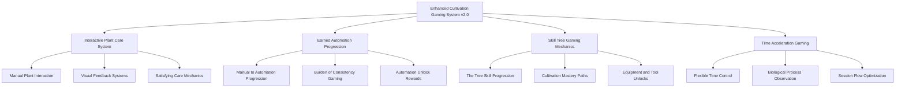

# 🌱 Enhanced Cultivation Gaming System v2.0 - Comprehensive Technical Specifications

**Earned Automation and Interactive Cultivation Gaming Platform**

---

## 📋 **Document Information**

- **Version**: 2.0 (Interactive Cultivation Gaming Platform)
- **System Type**: Enhanced Cultivation Gaming with Earned Automation Progression
- **Priority Level**: Critical (Core Plant Interaction System)
- **Dependencies**: Genetics, Environment, Progression, Construction, Economic Systems
- **Integration**: Complete Cannabis Gaming Ecosystem with Interactive Cultivation Mechanics

---

## 🎯 **Executive Summary**

The Enhanced Cultivation Gaming System v2.0 transforms Project Chimera's cultivation simulation into an engaging and rewarding video game experience. This system focuses on interactive plant care mechanics, earned automation progression, and satisfying gameplay loops that make cannabis cultivation fun and entertaining.

Players begin with hands-on manual cultivation and gradually unlock automation systems through skill progression, creating a satisfying journey from intimate plant care to sophisticated facility management. The system emphasizes player agency, meaningful choices, and the rewarding "burden of consistency" that drives automation desires.

### **Core Gaming Pillars**

1. **Earned Automation Philosophy**: Progress from manual care to sophisticated automation through gameplay
2. **Interactive Plant Care**: Engaging hands-on cultivation mechanics with satisfying feedback
3. **Skill Tree Progression**: "The Tree" metaphor with branching cultivation mastery paths
4. **Time Acceleration Gaming**: Flexible time control for engaging biological process observation
5. **Player Agency**: Multiple cultivation approaches and facility design choices

---

## 💼 **System Architecture Overview**

### **Interactive Cultivation Gaming Framework**



### **Integration with Core Project Chimera Systems**

- **Genetics Systems**: Breeding gameplay mechanics with trait discovery and strain development
- **Environmental Control**: Interactive climate management with hands-on and automated systems
- **Facility Construction**: Modular facility building with player creativity and optimization
- **Economic Systems**: Market-driven cultivation goals and profit optimization gameplay
- **Progression System**: Skill tree advancement with meaningful unlocks and player choice
- **Research Systems**: Discovery-based gameplay with experimentation and breakthrough moments

---

## 🎮 **Core Gaming Mechanics**

### **1. Interactive Plant Care System**

#### **Hands-On Cultivation Mechanics**
```csharp
public interface IInteractivePlantCare
{
    // Manual Care Interactions
    PlantCareResult PerformWatering(InteractivePlant plant, WateringTool tool, float amount);
    PlantCareResult PerformPruning(InteractivePlant plant, PruningTool tool, PruningType type);
    PlantCareResult PerformTraining(InteractivePlant plant, TrainingTool tool, TrainingMethod method);
    PlantCareResult PerformTransplanting(InteractivePlant plant, Container newContainer, GrowingMedium medium);
    
    // Visual Observation and Diagnosis
    PlantObservation InspectPlant(InteractivePlant plant, InspectionTool tool);
    PlantHealthStatus AssessPlantHealth(InteractivePlant plant, DiagnosticTool tool);
    EnvironmentalReading TakeEnvironmentalReading(EnvironmentalSensor sensor, Location location);
    
    // Satisfying Feedback Systems
    VisualFeedback ShowCareImpact(PlantCareResult careResult);
    AudioFeedback PlayCareResponse(PlantCareResult careResult);
    ProgressFeedback UpdateSkillProgress(CareAction careAction);
}
```

#### **Engaging Plant Interaction Mechanics**
- **Direct Plant Manipulation**: Click-and-drag pruning, LST bending, and training interactions
- **Tool-Based Care Actions**: Watering cans, pH meters, pruning shears with realistic usage
- **Visual Plant Responses**: Immediate visual feedback showing plant health improvements
- **Skill-Based Precision**: Player dexterity affects care quality and plant response
- **Discovery Through Observation**: Learning plant needs through visual cues and experimentation
- **Satisfying Care Loops**: Rewarding manual care cycles that feel meaningful and impactful

### **2. Earned Automation Progression System**

#### **Manual-to-Automation Gaming Mechanics**
```csharp
public class EarnedAutomationProgression
{
    // Burden of Consistency Gaming
    public AutomationDesire CalculateAutomationDesire(ManualCareTask task, PlayerProficiency proficiency)
    {
        return new AutomationDesire
        {
            CognitiveLoad = CalculateMentalEffort(task.Complexity, task.Frequency),
            TimeInvestment = CalculateTimeRequirement(task.Duration, task.PlantCount),
            ConsistencyChallenge = CalculateConsistencyDifficulty(task.PrecisionRequired, proficiency.CurrentSkill),
            ScalePressure = CalculateScalingPressure(task.PlantCount, task.FacilitySize),
            QualityRisk = CalculateQualityImpact(task.ErrorTolerance, proficiency.ConsistencyRating)
        };
    }
    
    // Automation Unlock Rewards
    public AutomationUnlock UnlockAutomationSystem(CultivationTask task, PlayerProgress progress)
    {
        return new AutomationUnlock
        {
            IrrigationAutomation = UnlockWateringSystem(task.WateringBurden, progress.IrrigationMastery),
            EnvironmentalAutomation = UnlockClimateControl(task.ClimateManagement, progress.EnvironmentalSkill),
            NutrientAutomation = UnlockFertigation(task.NutrientMixing, progress.NutritionExpertise),
            MonitoringAutomation = UnlockSensorSystems(task.DataCollection, progress.ObservationSkill),
            LightingAutomation = UnlockLightScheduling(task.LightManagement, progress.PhotoperiodKnowledge)
        };
    }
    
    // Progressive Automation Benefits
    public AutomationBenefits CalculateAutomationImpact(AutomationLevel level, FacilityScale scale)
    {
        return new AutomationBenefits
        {
            ConsistencyImprovement = CalculateConsistencyBonus(level.PrecisionControl),
            EfficiencyGains = CalculateEfficiencyBonus(level.AutomationCoverage),
            ScalabilityEnhancement = CalculateScalingBonus(level.SystemIntegration, scale.PlantCount),
            QualityOptimization = CalculateQualityBonus(level.PrecisionControl),
            TimeLiberation = CalculateTimeBonus(level.AutomationCoverage, scale.TaskComplexity)
        };
    }
}
```

#### **"Burden of Consistency" Gaming Philosophy**
- **Manual Care Challenges**: Increased difficulty maintaining precision with scale and time acceleration
- **Natural Automation Desire**: Players organically want automation as tasks become overwhelming
- **Earned Relief**: Automation feels rewarding because players experienced the manual burden
- **Graduated Consequences**: Suboptimal manual care has realistic impacts, not instant failure
- **Player Agency**: Players choose which tasks to automate based on personal pain points
- **Quality Incentives**: Peak genetic potential requires consistent precision that automation enables

### **3. "The Tree" Skill Progression Gaming System**

#### **Visual Metaphor: Cannabis Plant Skill Tree**
```csharp
public class TreeSkillProgression
{
    // "The Tree" Visual Structure
    public enum SkillTreeStructure
    {
        RootSystem,           // Foundation skills that support everything
        MainStem,            // Core cultivation progression path
        PrimaryBranches,     // Major skill categories (7 primary "leaves")
        SecondaryBranches,   // Specialized skill subcategories
        LeafNodes,           // Individual skills and techniques
        FloweringNodes,      // Advanced mastery achievements
        CannabisCanopy       // Complete cultivation mastery visualization
    }
    
    // Skill Tree Categories ("Primary Leaves")
    public SkillTreeCategories DefineSkillCategories()
    {
        return new SkillTreeCategories
        {
            Genetics = new SkillBranch(8, 12, "Breeding and genetic mastery"),
            Cultivation = new SkillBranch(6, 8, "Plant care and growing techniques"),
            Environment = new SkillBranch(6, 8, "Climate control and optimization"),
            Construction = new SkillBranch(4, 6, "Facility building and infrastructure"),
            Harvest = new SkillBranch(4, 6, "Post-harvest processing mastery"),
            Science = new SkillBranch(4, 6, "Data collection and analysis"),
            Business = new SkillBranch(3, 4, "Economic operations and management")
        };
    }
    
    // Node Unlocking Philosophy
    public SkillNodeUnlock UnlockSkillNode(SkillNode node, PlayerProgress progress)
    {
        return new SkillNodeUnlock
        {
            ConceptIntroduction = IntroduceCoreConcept(node.ConceptDefinition),
            MechanicActivation = ActivateGameMechanic(node.GameplayMechanic),
            EquipmentAccess = UnlockEquipmentProgression(node.EquipmentCategory),
            TechniqueAvailability = EnableCultivationTechnique(node.CultivationTechnique),
            AutomationPotential = GrantAutomationAccess(node.AutomationLevel)
        };
    }
}
```

#### **Skill Tree Gaming Principles**
- **Visual Growth Metaphor**: Tree becomes more vibrant and grows as player progresses
- **Concept Introduction**: Each node unlocks core concepts and associated mechanics
- **Equipment Progression**: Skills unlock access to better tools and equipment
- **Interdependency Rewards**: Cross-category skill combinations unlock bonus abilities
- **Player Choice Freedom**: Multiple viable progression paths support different playstyles
- **Ability vs. Challenge Balance**: New skills introduce new complexities to manage
- **Mastery Through Use**: Equipment and resource upgrades separate from skill unlocks

### **4. Time Acceleration Gaming System**

#### **Flexible Time Control for Biological Process Observation**
```csharp
public class TimeAccelerationGaming
{
    // Active Gameplay Time Scales
    public enum GameTimeScale
    {
        SlowMotion = 0.5f,        // 1 in-game day = 5 real minutes (12 game days/hour)
        Baseline = 1.0f,          // 1 in-game week = 1 real hour
        Standard = 2.0f,          // 1 in-game day = 2 real minutes (30 game days/hour)
        Fast = 4.0f,              // 1 in-game day = 1 real minute (60 game days/hour)
        VeryFast = 8.0f,          // For advanced automated facilities
        Lightning = 12.0f         // Maximum speed for stable operations
    }
    
    // Time Acceleration Gaming Mechanics
    public TimeAccelerationResult ProcessTimeAcceleration(FacilityState facility, GameTimeScale scale)
    {
        return new TimeAccelerationResult
        {
            PlantVisualChanges = AccelerateVisualGrowth(facility.Plants, scale),
            ManualTaskFrequency = CalculateTaskFrequency(facility.ManualTasks, scale),
            ResourceConsumption = AccelerateResourceUse(facility.Resources, scale),
            EnvironmentalDrift = AccelerateEnvironmentalChanges(facility.Environment, scale),
            AutomationBenefit = CalculateAutomationAdvantage(facility.AutomationLevel, scale),
            PlayerEngagement = OptimizePlayerExperience(facility.PlayerSkill, scale)
        };
    }
    
    // Transition Inertia System
    public TimeTransition ManageTimeTransition(GameTimeScale currentScale, GameTimeScale targetScale)
    {
        return new TimeTransition
        {
            LockInDuration = CalculateLockInTime(targetScale),
            TransitionDelay = CalculateTransitionDelay(currentScale, targetScale),
            RiskWarning = GenerateSpeedChangeWarning(currentScale, targetScale),
            BenefitPreview = ShowSpeedChangeBenefits(targetScale),
            CommitmentRequired = RequirePlayerCommitment(targetScale)
        };
    }
}
```

#### **Time Acceleration Gaming Benefits**
- **Biological Process Observation**: Watch plant growth, flowering, and responses in real-time
- **Session Flow Optimization**: Match game speed to available play time and engagement level
- **Automation Incentive**: Higher speeds make automation more valuable and desirable
- **Strategic Commitment**: Speed changes require strategic planning and commitment
- **Graduated Difficulty**: Faster speeds increase precision requirements for manual tasks
- **Visual Feedback**: Clear time indicators help players understand progression speed
- **Offline Progression**: Flexible offline time progression with catch-up visualization

---

## 🎯 **Player Agency and Choice-Driven Gaming**

### **1. Multiple Cultivation Approaches**

#### **Diverse Playstyle Support**
```csharp
public class PlayerAgencyGaming
{
    // Cultivation Philosophy Approaches
    public enum CultivationApproach
    {
        OrganicTraditional,       // Natural, soil-based growing with organic nutrients
        HydroponicPrecision,     // Hydroponic systems with precise nutrient control
        AeroponicCutting,        // Advanced aeroponic systems for maximum yields
        BiodynamicHolistic,      // Holistic approach with natural cycles and biodiversity
        TechnologicalAutomated,  // High-tech automated systems with sensor networks
        ExperimentalInnovative,  // Experimental techniques and novel growing methods
        EconomicOptimized        // Profit-focused cultivation with cost optimization
    }
    
    // Player Choice Systems
    public CultivationPath DefineCultivationPath(PlayerPreferences preferences)
    {
        return new CultivationPath
        {
            GrowingMediumChoice = SelectGrowingMedium(preferences.NaturalVsTechnological),
            NutrientStrategy = ChooseNutrientStrategy(preferences.OrganicVsHydroponic),
            AutomationLevel = DetermineAutomationLevel(preferences.HandsOnVsAutomated),
            FacilityDesign = CreateFacilityDesign(preferences.CreativeVsEfficient),
            BreedingFocus = SelectBreedingFocus(preferences.QualityVsQuantity),
            MarketStrategy = DefineMarketStrategy(preferences.ProfitVsPassion)
        };
    }
    
    // Meaningful Choice Consequences
    public ChoiceConsequences ProcessPlayerChoices(CultivationPath path, PlayerDecision decision)
    {
        return new ChoiceConsequences
        {
            ImmediateImpact = CalculateImmediateEffects(decision, path.CurrentState),
            LongTermImplications = ProjectLongTermOutcomes(decision, path.Strategy),
            ResourceRequirements = DetermineResourceNeeds(decision, path.Scale),
            SkillDevelopment = InfluenceSkillProgression(decision, path.Focus),
            MarketPosition = AffectMarketStanding(decision, path.Reputation)
        };
    }
}
```

### **2. Facility Design and Construction Choice Systems**

#### **Creative Facility Building Gaming**
```csharp
public class FacilityDesignGaming
{
    // Construction Approach Options
    public enum FacilityDesignApproach
    {
        MinimalistEfficient,     // Streamlined designs focused on pure efficiency
        CreativeInnovative,      // Unique layouts with experimental configurations
        ModularExpandable,       // Systematic designs built for easy expansion
        AestheticShowcase,       // Beautiful facilities that balance form and function
        BudgetOptimized,         // Cost-effective solutions with smart compromises
        TechnologicalCutting,    // High-tech facilities with latest automation
        SustainableEcological    // Environmentally conscious and sustainable designs
    }
    
    // Player Creativity Systems
    public FacilityCreationResult ProcessFacilityDesign(PlayerDesignChoices choices)
    {
        return new FacilityCreationResult
        {
            LayoutEfficiency = CalculateLayoutEfficiency(choices.RoomArrangement),
            AestheticValue = EvaluateAestheticDesign(choices.VisualTheme),
            FunctionalOptimization = AssessFunctionalDesign(choices.WorkflowOptimization),
            ExpansionPotential = DetermineExpansionOptions(choices.ModularityLevel),
            BudgetEffectiveness = CalculateCostEfficiency(choices.ResourceAllocation),
            InnovationBonus = RewardInnovativeDesign(choices.CreativeElements)
        };
    }
    
    // Choice Impact on Gameplay
    public DesignConsequences ApplyDesignChoices(FacilityDesign design, CultivationOperations operations)
    {
        return new DesignConsequences
        {
            OperationalEfficiency = design.WorkflowOptimization * operations.DailyTaskComplexity,
            MaintenanceCosts = design.ComplexityLevel * operations.MaintenanceFrequency,
            UpgradeFlexibility = design.ModularityLevel * operations.ExpansionNeeds,
            PlayerSatisfaction = design.AestheticValue * operations.TimeSpentInFacility,
            AutomationPotential = design.TechnologyLevel * operations.AutomationDesire
        };
    }
}
```

#### **Player Creativity and Expression**
- **Freeform Facility Design**: Creative freedom in layout and aesthetic choices
- **Modular Construction System**: Mix-and-match components for unique configurations
- **Workflow Optimization Challenges**: Design facilities that optimize daily operations
- **Aesthetic Customization**: Visual themes and decorative elements for personal expression
- **Innovation Rewards**: Bonus benefits for creative and efficient design solutions
- **Expansion Planning**: Designing facilities that accommodate future growth needs

---

## 🔧 **Implementation Architecture**

### **1. ChimeraManager Integration**

#### **Enhanced Cultivation Gaming Manager**
```csharp
public class EnhancedCultivationGamingManager : ChimeraManager, IChimeraManager
{
    [Header("Interactive Plant Care")]
    [SerializeField] private InteractivePlantCareSystem _plantCareSystem;
    [SerializeField] private PlantInteractionController _interactionController;
    [SerializeField] private CareToolManager _careToolManager;
    
    [Header("Earned Automation")]
    [SerializeField] private EarnedAutomationProgressionSystem _automationProgression;
    [SerializeField] private AutomationUnlockManager _automationUnlocks;
    [SerializeField] private ManualTaskBurdenCalculator _burdenCalculator;
    
    [Header("Skill Tree Gaming")]
    [SerializeField] private TreeSkillProgressionSystem _skillTreeSystem;
    [SerializeField] private SkillNodeUnlockManager _nodeUnlockManager;
    [SerializeField] private SkillTreeVisualizationController _treeVisualization;
    
    [Header("Time Acceleration")]
    [SerializeField] private TimeAccelerationGamingSystem _timeAccelerationSystem;
    [SerializeField] private TimeTransitionManager _timeTransitionManager;
    [SerializeField] private GameSpeedController _gameSpeedController;
    
    [Header("Player Agency")]
    [SerializeField] private PlayerAgencyGamingSystem _playerAgencySystem;
    [SerializeField] private CultivationPathManager _cultivationPathManager;
    [SerializeField] private FacilityDesignGamingSystem _facilityDesignSystem;
    
    // Gaming Event Channels
    [Header("Event Channels")]
    [SerializeField] private GameEventChannelSO _onPlantCarePerformed;
    [SerializeField] private GameEventChannelSO _onAutomationUnlocked;
    [SerializeField] private GameEventChannelSO _onSkillNodeUnlocked;
    [SerializeField] private GameEventChannelSO _onTimeScaleChanged;
    [SerializeField] private GameEventChannelSO _onPlayerChoiceMade;
    
    protected override void OnManagerInitialize()
    {
        InitializeInteractivePlantCare();
        InitializeEarnedAutomationProgression();
        InitializeSkillTreeGaming();
        InitializeTimeAccelerationGaming();
        InitializePlayerAgencyGaming();
        
        RegisterEventHandlers();
    }
    
    private void InitializeInteractivePlantCare()
    {
        _plantCareSystem.Initialize();
        _interactionController.Initialize();
        _careToolManager.Initialize();
    }
    
    private void InitializeEarnedAutomationProgression()
    {
        _automationProgression.Initialize();
        _automationUnlocks.Initialize();
        _burdenCalculator.Initialize();
    }
    
    private void InitializeSkillTreeGaming()
    {
        _skillTreeSystem.Initialize();
        _nodeUnlockManager.Initialize();
        _treeVisualization.Initialize();
    }
    
    private void InitializeTimeAccelerationGaming()
    {
        _timeAccelerationSystem.Initialize();
        _timeTransitionManager.Initialize();
        _gameSpeedController.Initialize();
    }
    
    private void InitializePlayerAgencyGaming()
    {
        _playerAgencySystem.Initialize();
        _cultivationPathManager.Initialize();
        _facilityDesignSystem.Initialize();
    }
}
```

### **2. ScriptableObject Data Structures**

#### **Enhanced Cultivation Gaming Configuration**
```csharp
[CreateAssetMenu(fileName = "New Enhanced Cultivation Gaming Config", 
                 menuName = "Project Chimera/Gaming/Enhanced Cultivation Gaming Config")]
public class EnhancedCultivationGamingConfigSO : ChimeraConfigSO
{
    [Header("Interactive Plant Care Configuration")]
    public InteractivePlantCareConfigSO PlantCareConfig;
    public CareToolLibrarySO CareToolLibrary;
    public PlantInteractionConfigSO InteractionConfig;
    
    [Header("Earned Automation Configuration")]
    public EarnedAutomationConfigSO AutomationConfig;
    public AutomationUnlockLibrarySO AutomationUnlocks;
    public BurdenCalculationConfigSO BurdenCalculation;
    
    [Header("Skill Tree Gaming Configuration")]
    public TreeSkillProgressionConfigSO SkillTreeConfig;
    public SkillNodeLibrarySO SkillNodeLibrary;
    public SkillTreeVisualizationConfigSO TreeVisualization;
    
    [Header("Time Acceleration Gaming Configuration")]
    public TimeAccelerationGamingConfigSO TimeAccelerationConfig;
    public TimeScaleLibrarySO TimeScaleLibrary;
    public TimeTransitionConfigSO TimeTransitionConfig;
    
    [Header("Player Agency Gaming Configuration")]
    public PlayerAgencyGamingConfigSO PlayerAgencyConfig;
    public CultivationPathLibrarySO CultivationPaths;
    public FacilityDesignConfigSO FacilityDesignConfig;
    
    [Header("Gaming Balance Configuration")]
    [Range(0.1f, 2.0f)] public float ManualCareBaseEfficiency = 1.0f;
    [Range(1.1f, 3.0f)] public float AutomationEfficiencyMultiplier = 1.5f;
    [Range(0.1f, 1.0f)] public float SkillProgressionRate = 0.5f;
    [Range(1.0f, 10.0f)] public float TimeAccelerationMaxMultiplier = 8.0f;
    [Range(0.1f, 2.0f)] public float PlayerChoiceImpactMultiplier = 1.0f;
}
```

### **3. Enhanced Gaming Event System**

#### **Cultivation Gaming Events**
```csharp
[CreateAssetMenu(fileName = "New Cultivation Gaming Event", 
                 menuName = "Project Chimera/Gaming/Cultivation Gaming Event")]
public class CultivationGamingEventSO : GameEventChannelSO
{
    public enum CultivationGamingEventType
    {
        PlantCarePerformed,
        AutomationSystemUnlocked,
        SkillNodeProgressed,
        TimeScaleChanged,
        PlayerChoiceImpacted,
        FacilityDesignCompleted,
        CultivationPathSelected,
        ManualTaskBurdenIncreased,
        AutomationBenefitRealized,
        SkillTreeVisualizationUpdated
    }
    
    [Header("Gaming Event Configuration")]
    public CultivationGamingEventType EventType;
    public string EventDescription;
    public float EventImpactMagnitude = 1.0f;
    public bool TriggerFeedbackSystems = true;
    public bool UpdateProgressionSystems = true;
}
```

---

## 🎮 **Gaming Experience Optimization**

### **1. Satisfying Gameplay Loops**

#### **Minute-to-Minute Gaming Loop**
1. **Observe Plant State**: Visual inspection and status assessment
2. **Identify Care Needs**: Recognition of plant requirements through observation
3. **Select Appropriate Tools**: Choose optimal care tools and techniques
4. **Perform Care Actions**: Execute precise care with skill-based outcomes
5. **Receive Immediate Feedback**: Visual, audio, and progression feedback systems
6. **Assess Care Impact**: Observe plant response and care effectiveness
7. **Progress Skill Development**: Incremental improvement in care capabilities

#### **Hour-to-Hour Gaming Loop**
1. **Session Goal Setting**: Define objectives and priorities for the session
2. **Facility Management**: Monitor and optimize overall facility operations
3. **Automation Evaluation**: Assess manual task burden and automation opportunities
4. **Skill Tree Progression**: Allocate skill points and unlock new capabilities
5. **Time Scale Optimization**: Adjust game speed for optimal experience flow
6. **Choice Implementation**: Make strategic decisions affecting cultivation path
7. **Session Achievement**: Complete objectives and prepare for offline progression

### **2. Player Motivation and Engagement**

#### **Self-Determination Theory Application**
- **Autonomy**: Multiple viable cultivation paths and player choice freedom
- **Competence**: Progressive skill mastery with clear advancement indicators
- **Relatedness**: Community features and shared cultivation achievements

#### **Flow State Optimization**
- **Clear Goals**: Well-defined objectives and progression milestones
- **Immediate Feedback**: Responsive systems with satisfying visual and audio cues
- **Challenge-Skill Balance**: Dynamic difficulty adjustment through automation progression
- **Deep Immersion**: Time acceleration and engaging care mechanics

#### **Player Type Support (Bartle Taxonomy)**
- **Achievers**: Comprehensive skill trees and achievement systems
- **Explorers**: Discovery-based gameplay and experimental cultivation techniques
- **Socializers**: Community features and shared facility showcases
- **Killers**: Competitive cultivation and market dominance mechanics

---

## 📊 **Success Metrics and KPIs**

### **Gaming Engagement Metrics**
- **Session Duration**: Average player session length and engagement depth
- **Skill Progression Rate**: Speed of skill tree advancement and node unlocking
- **Automation Adoption**: Timeline from manual care to automation implementation
- **Choice Diversity**: Variety of cultivation paths and facility designs chosen
- **Time Scale Usage**: Distribution of time acceleration settings and preferences

### **Player Satisfaction Indicators**
- **Care Action Frequency**: Engagement with interactive plant care mechanics
- **Facility Creativity Score**: Innovation and aesthetic value of player-designed facilities
- **Path Completion Rate**: Percentage of players completing chosen cultivation paths
- **Skill Mastery Achievement**: Players reaching advanced skill tree nodes
- **Long-term Retention**: Player return rates and sustained engagement

---

## 🚀 **Implementation Roadmap**

### **Phase 1: Interactive Plant Care Foundation**
- Implement hands-on care mechanics and tool systems
- Develop visual feedback and plant response systems
- Create satisfying manual care gameplay loops

### **Phase 2: Earned Automation Progression**
- Build burden calculation and automation desire systems
- Implement automation unlock mechanics and rewards
- Balance manual vs. automated gameplay progression

### **Phase 3: Skill Tree Gaming Integration**
- Create "The Tree" visual metaphor and progression system
- Implement skill node unlocking and interdependency mechanics
- Develop equipment and technique progression systems

### **Phase 4: Time Acceleration Gaming**
- Build flexible time control and acceleration systems
- Implement transition inertia and strategic commitment mechanics
- Optimize session flow and biological process observation

### **Phase 5: Player Agency and Choice Systems**
- Develop multiple cultivation approach frameworks
- Create facility design and construction choice systems
- Implement meaningful consequence systems for player decisions

---

## 🎯 **Conclusion**

The Enhanced Cultivation Gaming System v2.0 transforms Project Chimera's sophisticated cannabis cultivation simulation into an engaging and entertaining video game experience. By focusing on interactive plant care, earned automation progression, skill tree advancement, time acceleration gaming, and meaningful player choices, this system delivers the fun and rewarding gameplay that makes cannabis cultivation truly enjoyable.

The system maintains the underlying simulation complexity while presenting it through engaging gaming mechanics that motivate players to progress from hands-on manual cultivation to sophisticated automated operations. Through the "burden of consistency" philosophy and "The Tree" skill progression metaphor, players experience a satisfying journey of mastery and capability development.

This gaming-focused approach ensures that Project Chimera achieves its vision of being an extremely fun and engaging video game while leveraging its advanced simulation technology to create unprecedented depth and authenticity in cannabis cultivation gaming.